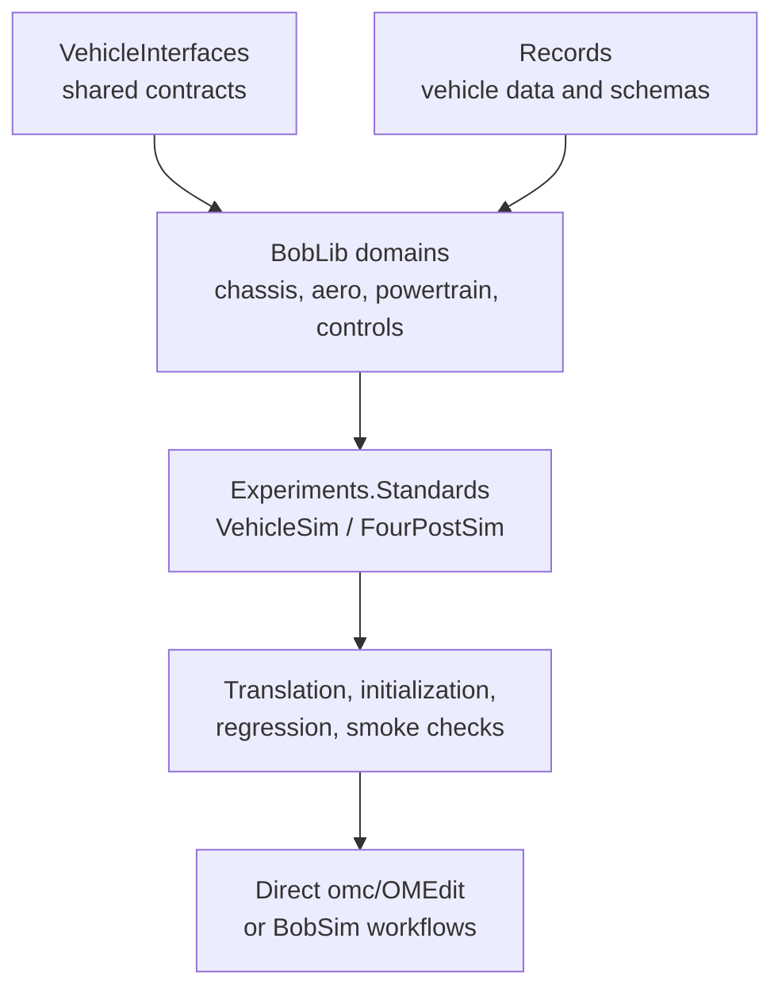

# BobDyn/BobLib

BobLib is the Modelica vehicle model library for BobDyn. It holds the chassis,
suspension, tire, aero, powertrain, and control physics, built inside the
VehicleInterfaces contracts.

| Use | When you want to |
| :-- | :-- |
| BobLib | Inspect, change, translate, simulate, or debug the Modelica models directly. Browse diagrams in OMEdit. Run regression tests. |
| [BobSim](/bobsim/) | Run complete vehicle studies: case execution, signal extraction, metrics, plots, reports, envelope maps, and sensitivity studies. |

::: info In-package documentation
BobLib ships its own guide at `BobLib.UsersGuide`. BobLib's README treats it as
the source of truth for the package version. If this site and the UsersGuide
disagree, the UsersGuide wins.
:::

## Key facts

| Item | Value |
| :-- | :-- |
| Package | `BobLib` (version `0.2.0` in `BobLib/package.mo`) |
| Test package | `Tests/BobLibTest`, a sibling package of regression and component fixtures |
| Dependencies | Modelica Standard Library `4.1.0`, VehicleInterfaces `2.0.2` |
| Entry points | `Experiments.Standards.VehicleSim`, `FourPostSim`, and `VehicleFMI` |
| Vehicle data | Checked-in Modelica records. There is no Python or YAML generation step. |
| Shared signals | The VehicleInterfaces `controlBus`, plus a BobLib `AtmosphereBus` |
| Animation | On by default (`headless = false`) |

## How the parts fit

The standard entry points extend checked-in templates under
`BobLib.Experiments.Standards.Templates`. To change a vehicle, you edit records
and templates, translate the entry points, run the checks, and then simulate
directly or through BobSim.

Text version

1. VehicleInterfaces (shared contracts) and Records (vehicle data and schemas) feed the BobLib domains: chassis, aero, powertrain, controls.
2. The domains feed Experiments.Standards: VehicleSim and FourPostSim.
3. The experiments go through translation, initialization, regression, and smoke checks.
4. Checked models run through direct omc/OMEdit or BobSim workflows.

## Pages

| Page | Use it for |
| :-- | :-- |
| [Setup](/boblib/setup) | Clone path, OpenModelica, libraries, Python environment |
| [CLI Workflow](/boblib/cli-workflow) | Load, build, and simulate with `omc` |
| [OMEdit Workflow](/boblib/omedit-workflow) | Open BobLib in OMEdit, browse diagrams, run a simulation |
| [Package Map](/boblib/package-map) | Repository layout and Modelica packages |
| [Control Bus](/boblib/control-bus) | Bus wiring, signal ownership, and what stays on explicit connectors |
| [Static Templates](/boblib/generation) | Records, redeclares, and architecture templates |
| [Entry Points](/boblib/entry-points) | `VehicleSim`, `FourPostSim`, `VehicleFMI`, maneuver modes, outputs |
| [Tests and Checks](/boblib/testing) | `make` targets, test files, baselines |
| [Development](/boblib/development) | Architecture rules and checks before you commit |
| [Troubleshooting](/boblib/troubleshooting) | OpenModelica, OMEdit, dependency, and check failures |

## Maturity

BobLib's README describes it as active engineering infrastructure, not a
finished general-purpose vehicle library. Validate model outputs against
measured data before you trust them. Release confidence comes from the BobLib
check suite plus BobSim's workflow-level checks.
