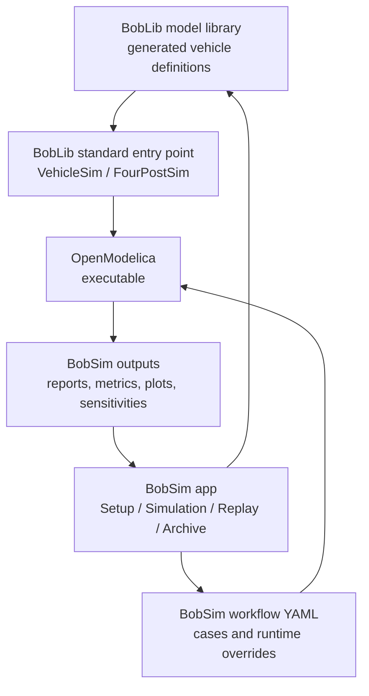

# BobDyn/BobSim

BobDyn/BobSim is the vehicle analysis workspace for BobDyn. It builds
BobDyn/BobLib Modelica vehicle models into OpenModelica executables, runs
standard studies on them, and writes a PDF report and a metrics CSV for each
study.

Use BobSim when the question is about vehicle response: how the car behaves in
a standard maneuver, which limit is active, or how a parameter change moves a
metric.

Use [BobDyn/BobLib](/boblib/) when the question is about the model itself:
Modelica package structure, VehicleInterfaces integration, records, tire
models, suspension assemblies, OMEdit inspection, or initialization debugging.

## Get started

For normal use, download the BobSim desktop asset for your operating system
from the [GitHub Release](https://github.com/BobDyn/BobSim/releases/latest),
extract it, and run `BobSim`. To run the app from a source checkout, see
[Install and launch](/bobsim/app#install-and-launch).

Then work through the app tabs in order:

```text
Setup -> Save Vehicle -> Write to MBD -> Simulation -> Archive
```


The same studies run from the command line. `make standard-eval-all` builds
missing Modelica executables, then runs RampSteerEval, SteadyStateEval,
TransientEval, and FourPostEval. See [Make targets](/bobsim/make-targets) for
the full list.

## How the pieces fit

BobSim keeps the physical model and the analysis workflow separate:

- The app saves the vehicle as YAML. `Write to MBD` generates the BobLib
  Modelica vehicle definition from it.
- BobLib owns the physical model and the standard entry points, `VehicleSim`
  and `FourPostSim`.
- BobSim workflow YAML owns the cases, solver settings, runtime overrides,
  signal extraction, plots, and report.

<div class="workflow-diagram">



</div>

<details class="diagram-text">
<summary>Text version</summary>

1. The BobSim app (Setup / Simulation / Replay / Archive) drives the BobLib model library (generated vehicle definitions) and the BobSim workflow YAML (cases and runtime overrides).
2. The model library feeds the BobLib standard entry point: VehicleSim or FourPostSim.
3. The entry point and the workflow YAML feed the OpenModelica executable.
4. The executable writes BobSim outputs: reports, metrics, plots, sensitivities.
5. The outputs go back to the app.

</details>

## Repository layout

| Path | Role |
| :-- | :-- |
| `makefile` | Commands for setup, build, run, test, and cleanup |
| `Dockerfile` | OpenModelica and Python environment |
| `docker-compose.yml` | Services that the make targets run in |
| `requirements.txt` | Python dependencies |
| `vehicle.yml` | Default vehicle definition |
| `_0_Utils/` | Shared utilities, plotting, reporting, and the BobLib submodule |
| `_0_Utils/external/BobLib/` | BobDyn/BobLib Modelica library checkout |
| `_1_VisualSim/` | BobVis: turns a simulation run into a 3D scene for the app's Replay tab |
| `_2_EnvelopeSim/` | Optional GGV and YMD envelope calculations, separate from the Modelica workflows |
| `_3_StandardSim/` | RampSteerEval, SteadyStateEval, TransientEval, and FourPostEval |
| `_4_OptSim/` | Sensitivity and response-surface workflows |
| `_5_App/` | Local browser app and its saved user data |
| `tests/` | Regression and release checks |

## Pages in this section

| Page | Use it for |
| :-- | :-- |
| [App](/bobsim/app) | Install the app, set up a vehicle, run a study, find the files |
| [StandardSim](/bobsim/standard-sim) | The four standard workflows, their configs, and their outputs |
| [Archive](/bobsim/results) | Where each output file is written and what it contains |
| [Replay](/bobsim/visualization) | Setup previews and 3D replay of a simulated run |
| [LotusShark Import](/bobsim/lotus-shark-import) | Import Lotus SHARK suspension geometry and compare it on the kinematic curves |
| [EnvelopeSim](/bobsim/envelope) | Optional GGV and YMD envelope calculations |
| [OptSim](/bobsim/doe) | Sensitivities and response surfaces over many vehicle variants |
| [Configuration](/bobsim/configuration) | Workflow YAML keys, runtime flags, report and plot config |
| [Development](/bobsim/development) | Docker, local Python, desktop builds, quality checks, troubleshooting |
| [Make targets](/bobsim/make-targets) | Every `make` target, grouped by area |

## Traceability

Every input that produced a report is a plain file you can keep with it:

- The vehicle is an app vehicle YAML plus the generated Modelica definition.
- Each Archive package stores a snapshot of the vehicle and run config.
- Workflow cases and runtime settings are YAML.
- Simulation overrides are written to `overrides.txt` for each case.
- Metrics are exported as CSV.
- Sensitivity variants are written as per-variant Modelica records.

You can trace a report metric back to the workflow config, the extracted
signals, the compiled executable, and the vehicle record.

EnvelopeSim is a separate implementation of common envelope calculations such
as GGV and YMD maps. It is meant to be usable and easy to read. It is not the
reference implementation of envelope theory.
