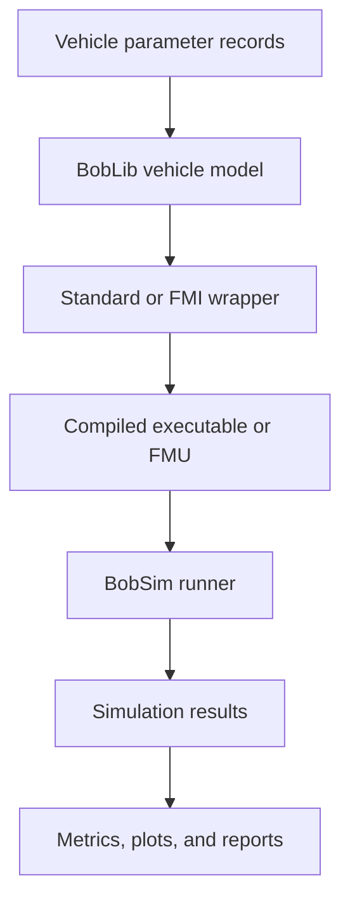

# BobLib

BobLib is the Modelica modeling library inside BobDyn. It contains the physical vehicle model, reusable subsystem models, vehicle parameter records, standard-test wrappers, utility functions, and test models.

BobSim uses BobLib as the modeling source of truth. The Python runner compiles selected BobLib models, runs simulations, extracts public output signals, and turns the results into metrics, plots, and reports.

## Design role

BobLib is responsible for the physical system. It should answer questions like:

- What components exist in the vehicle?
- How are those components connected?
- Which geometry, mass, stiffness, tire, steering, and powertrain parameters define the system?
- Which public variables should standard workflows expose to BobSim?

BobLib should not be responsible for report formatting, batch orchestration, or post-processing logic. Those responsibilities belong to BobSim.

## Package map

```text
BobLib
├── Vehicle      Physical vehicle and subsystem models
├── Standards    Standard-test wrappers and external simulation interfaces
├── Resources    Parameter records, vehicle definitions, and visual records
├── Utilities    Reusable math, mechanics, and FMI helpers
├── Tests        Executable subsystem and utility tests
└── Build        Generated build artifacts for native binaries and FMUs
```

## Core workflow



## Where to start

| Page | Purpose |
|:--|:--|
| [Package reference](./package-reference) | Complete package map and generated reference links. |
| [Vehicle package](./packages/vehicle/) | Physical vehicle, chassis, suspension, powertrain, and electronics models. |
| [Standards package](./packages/standards/) | Standard-test and FMI-facing simulation wrappers. |
| [Resources package](./packages/resources/) | Parameter records and vehicle definitions. |
| [Utilities package](./packages/utilities/) | Reusable helper functions and multibody components. |
| [Tests package](./packages/tests/) | Executable subsystem and utility tests. |

## Modeling principles

- **Physical model first.** Components should represent the real system structure wherever practical.
- **Records configure models.** Parameter records live under `Resources`; physical behavior lives under `Vehicle` and `Standards`.
- **Wrappers define workflows.** Standard tests and FMI interfaces should wrap the physical vehicle without duplicating it.
- **Public outputs are intentional.** Variables exposed from standard models form the signal contract used by BobSim.
- **Everything remains inspectable.** Modelica source, parameter records, build scripts, and tests are plain text.
