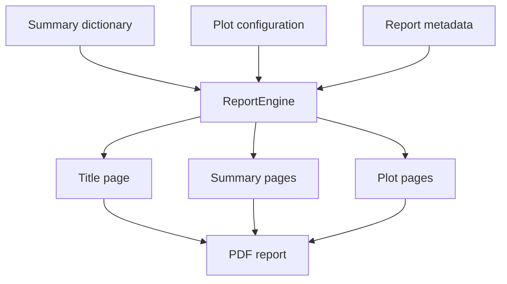

# Reporting utilities

The reporting layer builds PDF reports from summary dictionaries and plot configurations.

## Files

| File | Purpose |
|:--|:--|
| `_0_Utils/reporting/report_engine.py` | Main report builder. Opens the PDF and dispatches title, summary, and plot pages. |
| `_0_Utils/reporting/sections.py` | Page-level report sections for SteadyStateEval, TransientEval, and KnC. |
| `_0_Utils/reporting/media/bob.png` | Brand asset used by report pages. |

## Report flow

## Report sections

The active report sections focus on the current standard workflows:

- Steady-state cornering summary pages
- Transient steering summary pages
- KnC summary pages

## API inventory

### `report_engine.py`

| Symbol | Line | Notes |
|:--|--:|:--|
| `class ReportEngine` | 8 |  |
| `ReportEngine.__init__()` | 9 |  |
| `ReportEngine.build()` | 12 |  |

### `sections.py`

| Symbol | Line | Notes |
|:--|--:|:--|
| `add_summary_page()` | 6 | Shared summary page builder. |
| `add_knc_summary_page()` | 80 | KnC summary page builder. |
| `add_steady_state_step_page()` | 195 | Steady-state sweep summary page builder. |
| `add_transient_frequency_page()` | 260 | Transient frequency-response page builder. |
| `add_title_page()` | 375 | Title page builder. |
