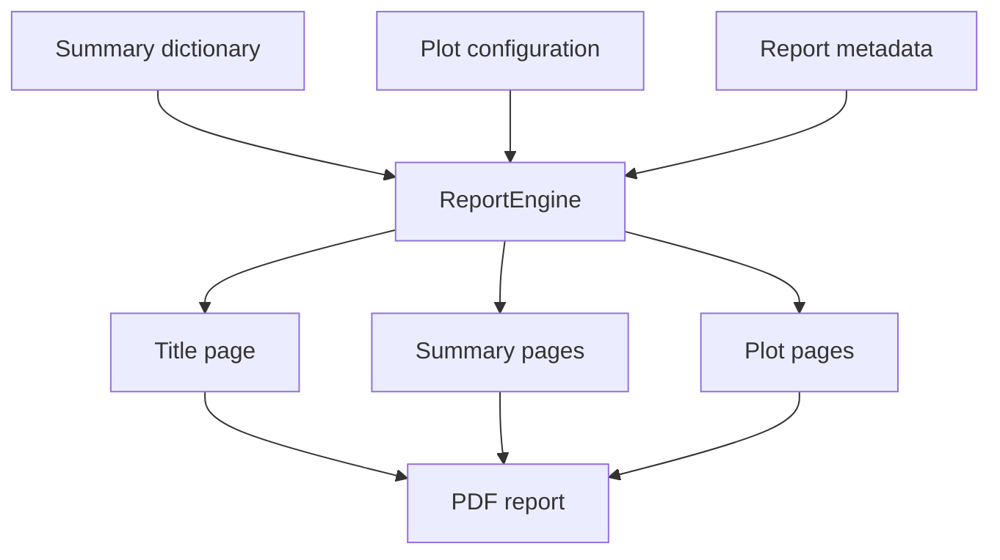

# Reporting utilities

The reporting layer builds PDF reports from standard summary dictionaries and plot configurations.

## Files

| File | Purpose |
|:--|:--|
| `_0_Utils/reporting/report_engine.py` | Main report builder. Opens the PDF and dispatches title/summary/plot pages. |
| `_0_Utils/reporting/sections.py` | Page-level report sections for summaries and standard-specific report content. |
| `_0_Utils/reporting/media/bob.png` | Brand asset used by report pages. |

## Report flow

## API inventory

### `report_engine.py`

| Symbol | Line | Notes |
|:--|--:|:--|
| `class ReportEngine` | 8 |  |
| `ReportEngine.__init__()` | 9 |  |
| `ReportEngine.build()` | 12 |  |

### `sections.py`

| Symbol | Line | Notes |
|:--|--:|:--|
| `add_summary_page()` | 6 |  |
| `add_knc_summary_page()` | 80 |  |
| `add_iso7401_step_page()` | 195 |  |
| `add_iso7401_frequency_page()` | 260 |  |
| `add_title_page()` | 375 |  |
