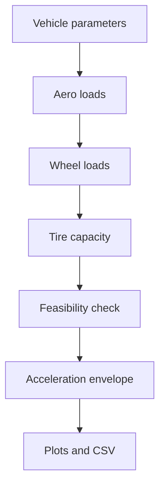

# GGV generation

The GGV tool generates longitudinal/lateral acceleration envelopes across speed.

## File

```text
_2_EnvelopeSim/GGV/ggv_generation.py
```

## Concept

A GGV diagram maps feasible combinations of longitudinal acceleration `ax`, lateral acceleration `ay`, and speed. It is useful for understanding power limits, braking limits, tire capacity, aero loading, and total vehicle acceleration capability.

## High-level flow



## Main outputs

The module can generate:

- 2D GGV envelopes,
- continuous GGV envelope surfaces,
- speed-dependent scalar capability metrics,
- CSV output for downstream analysis.

## API inventory

| Symbol | Line | Notes |
|:--|--:|:--|
| `class VehicleParams` | 45 |  |
| `class GGVConfig` | 93 |  |
| `class GGVEnvelope` | 114 |  |
| `force_to_aero_area()` | 121 | Convert CFD forces at a known speed to ClA and CdA. |
| `aero_loads()` | 146 | Return front downforce, rear downforce, and aero drag. |
| `tire_mu_x()` | 163 | Approximate longitudinal peak friction from .tir PDX terms. |
| `tire_mu_y()` | 183 | Approximate lateral peak friction from .tir PDY terms. |
| `wheel_loads()` | 204 | Estimate individual wheel normal loads. |
| `distribute_lateral_force()` | 255 | Distribute lateral force demand to each tire. |
| `distribute_longitudinal_force()` | 281 | Distribute longitudinal force demand to the tires. |
| `tire_usage()` | 316 | Elliptical combined tire usage at each tire. |
| `powertrain_force_limit()` | 342 | Maximum available drive force before tire limits. |
| `is_feasible()` | 354 | Check whether a requested ax-ay point is feasible. |
| `solve_ax_limit()` | 398 | Find the maximum feasible acceleration or braking at a given ay. |
| `warn_if_tire_loads_outside_tir_range()` | 433 | Scan generated finite GGV points and warn if wheel loads exceed .tir range. |
| `generate_ggv()` | 480 | Generate GGV envelopes across the configured speeds. |
| `plot_ggv()` | 632 | Plot ax-ay GGV envelopes. |
| `plot_ggv_surface()` | 691 | Plot the GGV as one continuous closed envelope surface. |
| `plot_ggv_metrics()` | 830 | Plot scalar capability metrics extracted from the GGV vs speed. |
| `save_ggv_csv()` | 931 | Save envelopes to CSV with columns: |
| `main()` | 966 |  |
