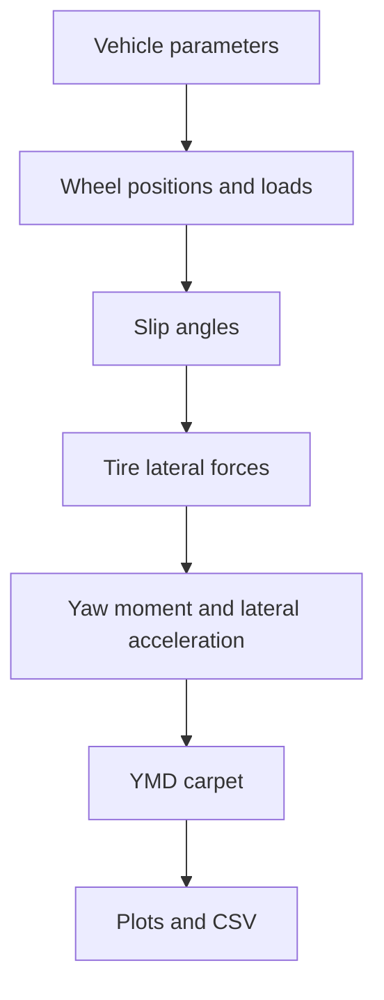

# Yaw-moment diagram generation

The YMD tool generates yaw-moment diagrams from a first-principles planar vehicle model.

## File

```text
_2_EnvelopeSim/YMD/ymd_generation.py
```

## Concept

A yaw-moment diagram sweeps sideslip and steering input to evaluate lateral acceleration and yaw moment behavior. It helps characterize balance, stability, controllability, and operating envelope structure.

## High-level flow



## Main outputs

The module can generate:

- traditional YMD carpet plots,
- beta-slice plots,
- contour maps,
- speed-sweep carpets,
- 3D speed-sweep surfaces,
- hull/shell visualizations,
- CSV output.

## API inventory

| Symbol | Line | Notes |
|:--|--:|:--|
| `class VehicleParams` | 49 |  |
| `class YMDConfig` | 92 |  |
| `class YMDResult` | 116 |  |
| `class YMDSpeedSweepResult` | 126 |  |
| `force_to_aero_area()` | 131 | Convert CFD forces at a known speed to ClA and CdA. |
| `aero_loads()` | 154 | Return front downforce, rear downforce, and aero drag. |
| `tire_mu_y()` | 172 | Approximate lateral peak friction from .tir PDY terms. |
| `tire_cornering_stiffness_y()` | 192 | Approximate lateral cornering stiffness from .tir PKY terms. |
| `saturated_lateral_force()` | 216 | Smooth lateral tire force model. |
| `wheel_positions()` | 240 | Wheel coordinates relative to CG. |
| `wheel_loads()` | 272 | Estimate individual wheel normal loads. |
| `tire_slip_angles()` | 321 | Compute tire slip angles for a simple planar 4-wheel model. |
| `ymd_point()` | 370 | Solve one quasi-static YMD point. |
| `generate_ymd()` | 438 | Generate a first-principles yaw moment diagram. |
| `warn_if_tire_loads_outside_tir_range()` | 518 | Scan approximate finite YMD points and warn if wheel loads exceed .tir range. |
| `value_to_blue_red()` | 566 | Map negative values to blue, positive values to red, and zero to light gray. |
| `plot_ymd()` | 588 | Traditional YMD wireframe/carpet plot. |
| `plot_ymd_beta_slices()` | 807 | Alternate YMD plot. |
| `plot_ymd_contours()` | 867 | Plot beta/roadwheel angle contour map for yaw moment, with ay contours. |
| `save_ymd_csv()` | 923 | Save YMD result to CSV. |
| `generate_ymd_speed_sweep()` | 963 | Generate YMD carpets across multiple velocities. |
| `plot_ymd_speed_sweep_3d()` | 1009 | Plot stacked YMD carpets across velocity. |
| `plot_ymd_speed_sweep_surface()` | 1120 | Plot YMD as stacked beta/hwa surfaces across speed. |
| `plot_ymd_speed_sweep_hull_surfaces()` | 1190 | Plot a convex hull shell around the full YMD speed sweep, plus a small |
| `main()` | 1501 |  |
