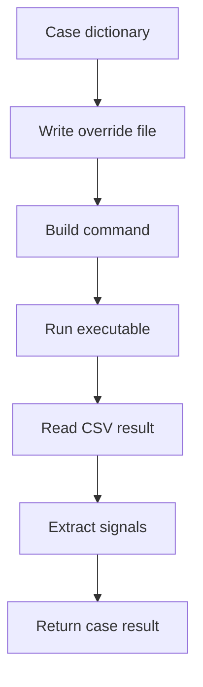

# Modelica runner

`ModelicaRunner` is the active runner for compiled OpenModelica executables.

## File

```text
_3_StandardSim/_modelica_runner.py
```

## Responsibilities

`ModelicaRunner` handles the mechanics of running many cases against one compiled executable:

- resolving the executable and matching initialization XML,
- creating isolated per-case run directories,
- writing `overrides.txt`,
- invoking the OpenModelica executable,
- passing solver and output flags,
- reading CSV results with pandas,
- extracting requested signals,
- preserving Python-only metadata,
- running serially or through `ProcessPoolExecutor`,
- optionally cleaning up temporary run folders.

## Case execution



## Runtime command shape

The runner builds OpenModelica executable commands using arguments such as:

```text
-overrideFile=<case overrides>
-r=<result path>
-stopTime=<case stop time>
-s=<solver>
-tolerance=<tolerance>
-lv=<log flags>
-variableFilter=<signal filter>
-noEquidistantTimeGrid
-noEventEmit
```

## Extraction modes

| Mode | Returned result |
|:--|:--|
| `raw` | Full time vector and full signal arrays. |
| `steady` | Final value for each extracted signal. |
| `last` | Final value for each extracted signal. |

## API inventory

| Symbol | Line | Notes |
|:--|--:|:--|
| `class ModelicaRunner` | 13 |  |
| `ModelicaRunner.__init__()` | 14 |  |
| `ModelicaRunner.from_config()` | 29 |  |
| `ModelicaRunner.run()` | 38 |  |
| `ModelicaRunner.run_cases()` | 62 |  |
| `ModelicaRunner.run_cases_parallel()` | 85 |  |
| `ModelicaRunner.run_case()` | 142 |  |
| `ModelicaRunner._run_subprocess_streamed()` | 216 |  |
| `ModelicaRunner._should_print_solver_line()` | 236 |  |
| `ModelicaRunner._extract_signals()` | 250 |  |
| `ModelicaRunner._write_override_file()` | 280 |  |
| `ModelicaRunner._format_override_value()` | 295 |  |
| `ModelicaRunner._build_command()` | 307 |  |
| `ModelicaRunner._case_label()` | 359 |  |
| `_run_case_worker()` | 384 |  |
