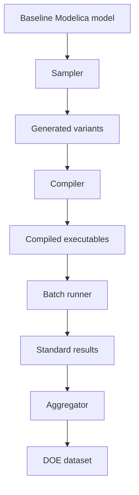

# DOE

`_4_DOE` contains a design-of-experiments pipeline scaffold for generating model variants, compiling them, running standards, and aggregating results.

## Files

```text
_4_DOE
├── sampler.py
├── generator.py
├── compiler.py
├── batch.py
├── aggregator.py
├── run_doe.py
└── configs
```

## Pipeline



## Maturity note

The DOE pipeline has real modules for sampling, generation, compilation, batch execution, and aggregation. It should still be treated as an active-development area until the public API and output contract settle.

## Config files

| File | Purpose |
|:--|:--|
| `_4_DOE/configs/doe_config.yaml` | Variant sampling and DOE setup. |
| `_4_DOE/configs/compiler_config.yaml` | Compile standards, build paths, and compiler options. |
| `_4_DOE/configs/build_template.mos` | Template used to generate Modelica build scripts. |

## API inventory

### `sampler.py`

| Symbol | Line | Notes |
|:--|--:|:--|
| `parse_mo_blocks()` | 9 |  |
| `_parse_params()` | 51 |  |
| `_parse_float()` | 79 | Safely parse a float from a Modelica parameter value string. |
| `load_config()` | 98 |  |
| `read_baseline()` | 103 |  |
| `sample()` | 118 |  |

### `generator.py`

| Symbol | Line | Notes |
|:--|--:|:--|
| `load_config()` | 8 |  |
| `substitute_param()` | 13 |  |
| `generate_variants()` | 69 | Write one variant.mo per variant dict into population/variant_N/. |

### `compiler.py`

| Symbol | Line | Notes |
|:--|--:|:--|
| `load_compiler_config()` | 39 |  |
| `generate_mos()` | 48 | Fill in build_template.mos for one variant + standard. |
| `compile_variant()` | 74 | Compile one variant for one standard. |
| `_find_exe()` | 121 | Return exe path if it exists. |
| `_write_error()` | 134 |  |
| `_compile_worker()` | 143 | Top-level function for ProcessPoolExecutor (must be picklable). |
| `compile_all()` | 156 | Compile all variants in population_dir for all standards in config. |

### `batch.py`

| Symbol | Line | Notes |
|:--|--:|:--|
| `load_config()` | 29 |  |
| `run_variant()` | 38 | Run one variant's executable for one standard. |
| `_find_exe()` | 83 |  |
| `_write_error()` | 98 |  |
| `_worker()` | 107 | Unpack args and run one variant. Returns (variant_name, standard, success). |
| `run_all()` | 118 | Run all compiled variants for all standards. |

### `aggregator.py`

| Symbol | Line | Notes |
|:--|--:|:--|
| `aggregate()` | 34 |  |

### `run_doe.py`

| Symbol | Line | Notes |
|:--|--:|:--|
| `_stage()` | 35 |  |
| `_elapsed()` | 41 |  |
| `run()` | 50 |  |
