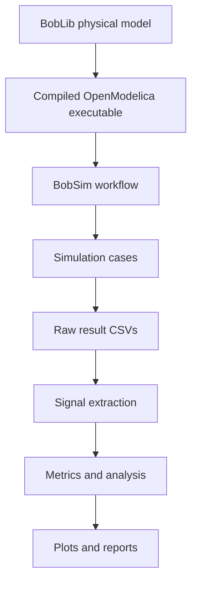
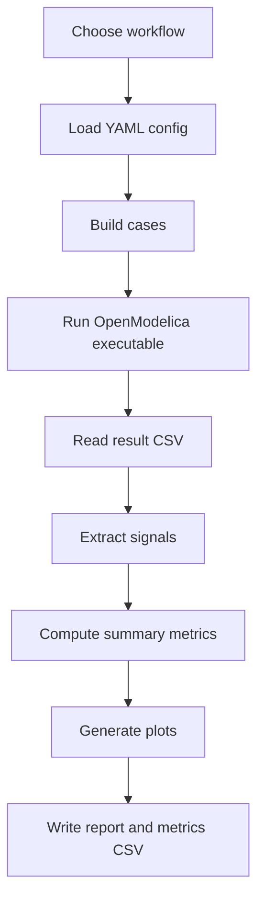

# BobSim

BobSim is the Python simulation runner, orchestration layer, and analysis workflow for BobDyn.

It uses BobLib models as the physical source of truth, then provides the surrounding tooling needed to build simulations, run repeatable studies, extract signals, compute metrics, generate plots, and produce engineering reports.



## Role in BobDyn

BobDyn separates physical modeling from simulation execution.

| Layer | Responsibility |
|:--|:--|
| **BobLib** | Defines the vehicle model, component architecture, parameters, and standard-test interfaces. |
| **BobSim** | Builds and runs simulations using BobLib, then processes the outputs into engineering results. |
| **BobDocs** | Documents the framework, workflows, configuration, signals, outputs, and conventions. |

BobSim is not intended to hide the model or solver. Instead, it makes the workflow repeatable: the model, configuration, simulation settings, extraction logic, metrics, plots, and reports are all visible and version-controlled.

---

## BobSim workflow

BobSim is designed around a repeatable simulation loop rather than a single one-off model run.



### 1. Choose a workflow

The active standard workflows are implemented as Python modules.

```bash
python -m _3_StandardSim.ISO4138.iso4138_sim
python -m _3_StandardSim.ISO7401.iso7401_sim
```

The Makefile exposes matching convenience targets.

```bash
make ISO4138
make ISO7401
```

### 2. Load YAML configuration

Each workflow has a YAML configuration file that describes simulation settings, execution settings, test inputs, plotting, and reporting.

Example configuration files:

```text
_3_StandardSim/ISO4138/iso4138_config.yml
_3_StandardSim/ISO7401/iso7401_config.yml
_3_StandardSim/KnC/knc_config.yml
```

### 3. Build cases

Each standard module builds a list of cases from the YAML config.

A case is a Python dictionary containing:

- Modelica override values,
- simulation metadata,
- duration and solver information,
- Python-only values needed later for summary and reporting.

Python-only metadata keys are conventionally prefixed with `_` so the runner can preserve them without passing them as Modelica overrides.

### 4. Run the executable

The primary runner is `ModelicaRunner` in:

```text
_3_StandardSim/_modelica_runner.py
```

For each case, it writes an override file, executes the compiled OpenModelica binary, and reads the result CSV. It supports both serial and process-pool parallel execution.

### 5. Extract signals

BobSim controls the result signal set through the configured `variable_filter` and through the runner extraction mode.

| Mode | Meaning |
|:--|:--|
| `raw` | Return full time arrays for each signal. |
| `steady` | Return final-sample values for each signal. |
| `last` | Return final-sample values for each signal. |

### 6. Summarize and report

Each standard module owns its own summary logic. The summary converts raw results into engineering-facing metrics and plot-ready series.

Shared utilities under `_0_Utils` render plots and build PDF reports.

Outputs are typically written under:

```text
_3_StandardSim/results/
```

---

## Infrastructure

BobSim includes Docker, Makefile, and dependency files to make the OpenModelica/Python workflow reproducible.

### Important files

| File | Purpose |
|:--|:--|
| `Dockerfile` | Builds on an OpenModelica image and installs Python dependencies. |
| `docker-compose.yml` | Defines containerized services for standard simulation and DOE workflows. |
| `makefile` | Provides convenience targets for setup, shell access, standard runs, DOE, and cleanup. |
| `requirements.txt` | Python runtime dependencies. |
| `pyproject.toml` | Python project/tooling metadata. |
| `ruff.toml` | Ruff configuration. |
| `.gitmodules` | BobLib submodule configuration. |

### Typical setup path

```bash
make init
make setup
omc _3_StandardSim/build.mos
make ISO4138
make ISO7401
```

### Build artifact convention

The active standard workflows expect a compiled executable under:

```text
_3_StandardSim/Build/
```

For the unified standard model, the executable name is usually:

```text
BobLib.Standards.VehicleModel
```

### Results convention

Generated public reports and metrics are written under:

```text
_3_StandardSim/results/
```

Examples:

```text
iso4138_report.pdf
iso4138_report_metrics.csv
iso7401_report.pdf
iso7401_report_metrics.csv
```

---

## Configuration

BobSim workflows are configured with YAML files. The public standard workflows use a common shape with workflow-specific sections.

### Common sections

| Section | Purpose |
|:--|:--|
| `standard` | Human-readable workflow identifier. |
| `simulation` | Backend, build path, executable name, solver, output format, filters, and runtime flags. |
| `execution` | Parallelism, worker count, cleanup behavior, and log streaming. |
| `sweep` / `test` | Workflow-specific case-generation inputs. |
| `controller` | Controller gains or runtime control options where applicable. |
| `fit` | Analysis fitting settings. |
| `report` | Report metadata and output path. |
| `plots` | Plot layouts, titles, axes, scaling, and fit configuration. |

### Simulation keys

| Key | Meaning |
|:--|:--|
| `backend` | Runtime backend, currently `modelica` for active standard workflows. |
| `build_dir` | Directory containing the compiled OpenModelica executable. |
| `exec_name` | Executable basename, usually `BobLib.Standards.VehicleModel`. |
| `stop_time` | Default stop time for each simulation case. |
| `solver` | OpenModelica solver, for example `dassl`. |
| `output_format` | Result file format, currently CSV for active workflows. |
| `log_level` | OpenModelica logging flags. |
| `variable_filter` | Regex-style signal filter passed to the executable. |
| `no_grid` | Enables non-equidistant time grid behavior. |
| `no_event_emit` | Suppresses event emission when enabled. |
| `visual` | Requests visual output for workflows that support it. |

### Execution keys

| Key | Meaning |
|:--|:--|
| `parallel` | Run cases in parallel when true. |
| `max_workers` | Process-pool worker count. |
| `cleanup` | Remove per-case run directories after extraction when true. |
| `stream_logs` | Stream subprocess output live when true. |

### ISO 4138 configuration shape

```yaml
standard: ISO4138

simulation:
  backend: modelica
  build_dir: _3_StandardSim/Build
  exec_name: BobLib.Standards.VehicleModel
  stop_time: 10.0
  solver: dassl
  output_format: csv
  log_level: LOG_STDOUT,LOG_ASSERT,LOG_STATS
  variable_filter: time|handwheelAngle|leftSteerAngle|rightSteerAngle|accY|roll|sideslip|handwheelTorque|velX|velY|yawVel
  no_grid: true
  no_event_emit: false

execution:
  parallel: true
  max_workers: 8
  cleanup: false
  stream_logs: false

sweep:
  testVel: 15.0
  n_cases: 10
  r_min: 12.5
  r_max: 100.0
  radius_bias_power: 2.5

controller:
  curv_kp: 3
  curv_ti: 0.02
  vel_kp: 200.0
  vel_ti: 1.0

fit:
  ay_linear_max: 6.0

report:
  enabled: true
  brand: BobSim
  title: ISO4138 Vehicle Characterization
  subtitle: OpenModelica Executable with Modelica PI Control
  output_path: _3_StandardSim/results/iso4138_report.pdf
```

### ISO 7401 configuration shape

```yaml
standard: ISO7401

simulation:
  backend: modelica
  build_dir: _3_StandardSim/Build
  exec_name: BobLib.Standards.VehicleModel
  solver: dassl
  output_format: csv
  log_level: LOG_STATS
  no_grid: true
  no_event_emit: false
  visual: true

execution:
  parallel: true
  max_workers: 8
  cleanup: true
  stream_logs: false

test:
  testVel: 20.0
  stepTime: 1.0
  run_step: true
  run_sine_one_period: true
  run_continuous_sine: true
  directions:
    - left
    - right
  representative_step_deg: 5.0
  representative_step_direction: left
  steerStep_deg:
    - 5.0
  representative_one_freq_hz: 1.0
  representative_one_amp_deg: 5.0
  representative_one_direction: left
  sine_freq_hz:
    - 1.0
  sine_amp_deg:
    - 5.0
  representative_cont_freq_hz: 1.0
  representative_cont_amp_deg: 5.0
  representative_cont_direction: left
  sweep_freq_hz:
    - 0.5
    - 0.75
    - 1.0
    - 1.5
    - 2.0
  sweep_amp_deg:
    - 5.0
  n_cycles: 5
  analyze_cycles_after: 1
  freq_response_amp_deg: 5.0
  freq_response_direction: left

report:
  enabled: true
  brand: BobSim
  title: ISO7401 Lateral Transient Response
  subtitle: Comprehensive Open-Loop Characterization
  output_path: _3_StandardSim/results/iso7401_report.pdf
```

### Plot configuration

Plots are configured in YAML under the `plots` section. Each plot entry describes the page layout, title, subplots, axis keys, labels, scaling, and optional fit behavior.

A simplified plot definition looks like this:

```yaml
plots:
  step_response:
    layout: triple
    title: Step Steer Response
    subplots:
      - title: Steering Wheel Angle
        x:
          key: step_time
          label: Time [s]
        y:
          key: step_steer
          label: Steering wheel angle [deg]
          scale: 57.3

      - title: Lateral Acceleration
        x:
          key: step_time
          label: Time [s]
        y:
          key: step_ay
          label: Lateral acceleration [m/s^2]

      - title: Yaw Velocity
        x:
          key: step_time
          label: Time [s]
        y:
          key: step_yaw
          label: Yaw velocity [rad/s]
```

Supported plot layouts are implemented in the shared plotting utilities under:

```text
_0_Utils/
```

---

## Design intent

BobSim keeps simulation reproducible by keeping each layer explicit:

- YAML describes the study.
- BobLib provides the physical model.
- OpenModelica executes the dynamics.
- Python orchestrates cases and analysis.
- Reports and metrics are regenerated from the same source data.

The result is a simulation workflow that can be inspected, modified, extended, or replaced without losing traceability from configuration to result.