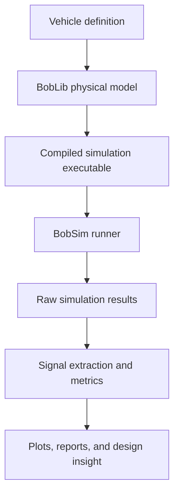

# Documentation

BobDyn is an open-source framework for physics-based vehicle simulation.

It is organized around a simple separation of responsibilities:

```text
BobDyn
├── BobLib   Physical vehicle modeling library
└── BobSim   Simulation runner, analysis, and reporting tools
```

BobLib defines the vehicle.  
BobSim runs simulations using that vehicle model.  
BobDyn is the complete workflow that connects modeling, execution, analysis, reporting, and design correlation.

## The core idea

Vehicles are dynamic systems. Their behavior is defined by how they respond to inputs: steering, throttle, braking, road motion, load transfer, tire forces, suspension motion, and driver commands.

BobDyn treats vehicle simulation as a characterization problem. The goal is not only to produce time histories, but to turn vehicle response into meaningful engineering evidence:

- How does the vehicle accelerate, roll, yaw, and settle?
- How does the response change across setups or architectures?
- Which metrics distinguish one design from another?
- How can a high-fidelity model be used to validate reduced-order models?

To support that workflow, BobDyn keeps the physical model as the source of truth.

## BobLib: the physical model

BobLib is the Modelica modeling library used by BobDyn.

It represents the vehicle as an acausal multibody dynamic system. Geometry, constraints, suspension members, steering, tires, chassis, and powertrain interfaces are modeled explicitly so the simulation architecture follows the structure of the real machine.

BobLib is intended to provide a transparent modeling backbone for vehicle dynamics research and design.

Go to [BobLib](./boblib/) to learn how the modeling library is organized.

## BobSim: the simulation workflow

BobSim is the Python simulation runner and analysis layer.

It uses BobLib models to build executables, run simulations, sweep cases, extract signals, compute metrics, generate plots, and produce reports. Instead of treating simulation as a one-off solver run, BobSim wraps the model in a repeatable engineering workflow.

BobSim is intended to make high-fidelity vehicle simulation practical: configure the study, run the model, collect the outputs, and turn the results into useful design information.

Go to [BobSim](./bobsim/) to learn how simulations are configured, executed, and analyzed.

## End-to-end workflow

A typical BobDyn workflow looks like this:



The same vehicle definition can be reused across multiple workflows: standard tests, design sweeps, envelope studies, reporting, and reduced-order model correlation.

## Documentation structure

This section is split into three parts:

| Section | Purpose |
|:--|:--|
| [Overview](./) | Explains the BobDyn project structure and workflow. |
| [BobLib](./boblib/) | Documents the Modelica vehicle modeling layer. |
| [BobSim](./bobsim/) | Documents the Python simulation, analysis, and reporting layer. |

Detailed configuration keys, signal names, outputs, and terminology live in the [Reference](/reference/) section.