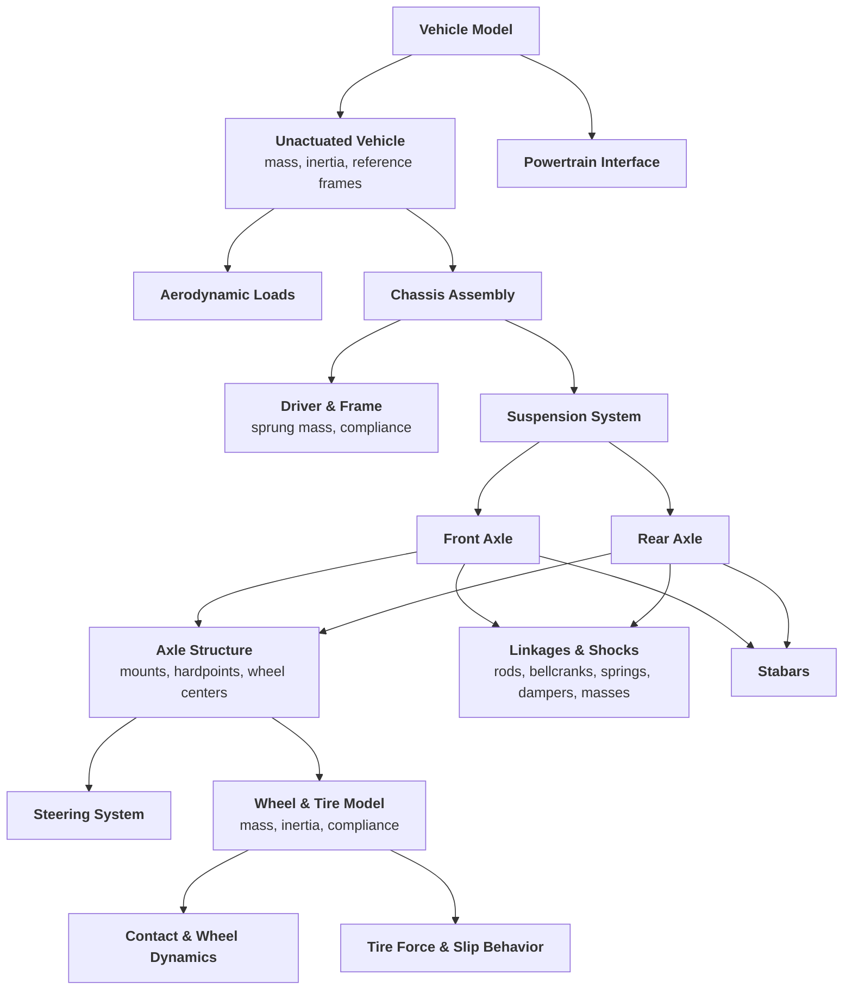

## Vehicle Model Structure

BobDyn models the vehicle as a hierarchy of physical systems. The structure is
explicit, so you can trace geometry, loads, constraints, and response signals
from full-vehicle behavior down to subsystem assumptions.

Start with [BobDyn/BobSim](/bobsim/) to set up a vehicle, run studies, and get
metrics, plots, and reports. Go to [BobDyn/BobLib](/boblib/) to inspect,
change, or debug the vehicle models directly.

<div class="model-structure-diagram">



</div>

<details class="diagram-text">
<summary>Text version</summary>

- Vehicle Model
  - Unactuated Vehicle: mass, inertia, reference frames
    - Chassis Assembly
      - Driver & Frame: sprung mass, compliance
      - Suspension System
        - Front Axle and Rear Axle
          - Axle Structure: mounts, hardpoints, wheel centers
            - Steering System
            - Wheel & Tire Model: mass, inertia, compliance
              - Contact & Wheel Dynamics
              - Tire Force & Slip Behavior
          - Linkages & Shocks: rods, bellcranks, springs, dampers, masses
          - Stabars
    - Aerodynamic Loads
  - Powertrain Interface

</details>

---

## How BobDyn Works

The driver feels a vehicle's response, not its equations. So BobDyn describes
vehicles with response metrics, keeps the model inspectable, and makes every
study traceable from configuration to report.

BobDyn/BobLib provides the physical vehicle model in Modelica. BobDyn/BobSim
runs repeatable studies on that model and turns the results into plots,
metrics, and reports. You can inspect, compare, and reuse those results across
design iterations.

Every part of the pipeline is plain text under version control:

| Part | Where it lives |
| :-- | :-- |
| Physical models | Modelica. Geometry, constraints, and force generation are written from first principles. |
| Configuration | Vehicle records, test setups, and simulation parameters in YAML and Modelica `.mo` files |
| Execution | Python workflows for simulation, extraction, analysis, and reporting. You can extend, change, or replace them. |
| Results | Outputs link back to the model structure, configuration, and equations that produced them. |

---

## What You Can Do With BobDyn

|Capability|Description|
|:--|:--|
|**Standard tests**|Run repeatable studies such as steady-state cornering, transient steering response, and kinematics/compliance workflows.|
|**Automated reporting**|Turn simulation output into metrics, plots, CSV files, and engineering reports with no manual post-processing.|
|**Model correlation**|Use full-system simulation results as reference data for reduced-order models, design tools, and simplifying assumptions.|
|**Design exploration**|Sweep parameters, compare configurations, and see how physical changes affect vehicle-level behavior.|

---

## Sample Outputs

The two animations show input samples: a closed-loop PI control input and an
open-loop prescribed-frequency input.

<div class="sample-output-grid">
  <article class="sample-output-card">
    <p class="sample-output-label">Closed-Loop PI Input Sample</p>
    <video autoplay loop muted playsinline width="100%">
      <source src="/steady_state_eval.mp4" type="video/mp4">
    </video>
    <p>
      A proof-of-concept closed-loop PI radius-control input. It is not
      presented as a tuned controller.
    </p>
    <div class="sample-output-links">
      <a href="/steady_state_eval.mp4" target="_blank" rel="noreferrer">Open sample</a>
    </div>
  </article>
  <article class="sample-output-card">
    <p class="sample-output-label">Open-Loop Frequency Input Sample</p>
    <video autoplay loop muted playsinline width="100%">
      <source src="/transient_eval.mp4" type="video/mp4">
    </video>
    <p>
      An open-loop prescribed steering-frequency input showing the vehicle
      response under a commanded steering sweep.
    </p>
    <div class="sample-output-links">
      <a href="/transient_eval.mp4" target="_blank" rel="noreferrer">Open sample</a>
    </div>
  </article>
</div>

The PDF reports come from BobDyn/BobSim StandardSim workflows. They are
separate studies, not the input samples above. Open a PDF link for a wider
view.

<div class="sample-output-grid">
  <article class="sample-output-card">
    <p class="sample-output-label">SteadyStateEval Report</p>
    <p>
      Ramp-steer velocity-isoline workflow with controller behavior, response
      traces, fitted handling metrics, and CSV-ready summary values.
    </p>
    <div class="sample-output-links">
      <a href="/steady_state_eval_report_1b607470.pdf" target="_blank" rel="noreferrer">Open PDF report</a>
    </div>
    <PdfEmbed src="/steady_state_eval_report_1b607470.pdf" max-height="34rem" />
  </article>
  <article class="sample-output-card">
    <p class="sample-output-label">TransientEval Report</p>
    <p>
      Step-steer and sine-response workflow with gain, phase, lag, rise-time,
      and overshoot metrics from the same Modelica vehicle model.
    </p>
    <div class="sample-output-links">
      <a href="/transient_eval_report_05d3fdda.pdf" target="_blank" rel="noreferrer">Open PDF report</a>
    </div>
    <PdfEmbed src="/transient_eval_report_05d3fdda.pdf" max-height="34rem" />
  </article>
</div>

## Quick Start

Run BobSim from a source checkout in Docker. You need Git, Make, and Docker.
The BobSim image contains OpenModelica and Python.

```bash
git clone --recurse-submodules https://github.com/BobDyn/BobSim.git
cd BobSim
make init
make docker-build
make app
```

Then open `http://127.0.0.1:8765` and follow:

```text
Setup -> Save Vehicle -> Write to MBD -> Simulation -> Archive
```


To run all four standard studies without the app, run
`make standard-eval-all`. It builds the Modelica executables when they are
missing, then runs RampSteerEval, SteadyStateEval, TransientEval, and
FourPostEval. The PDF reports and metrics CSVs go to
`_3_StandardSim/generated_results/`.

The [BobSim Startup](/startup-guide/bobsim) tutorial covers each step. To use
the released desktop app from the
[GitHub Release](https://github.com/BobDyn/BobSim/releases/latest) instead, see
[Run BobSim Without Docker](/startup-guide/bobsim-without-docker). The desktop
app needs a local OpenModelica to simulate.
