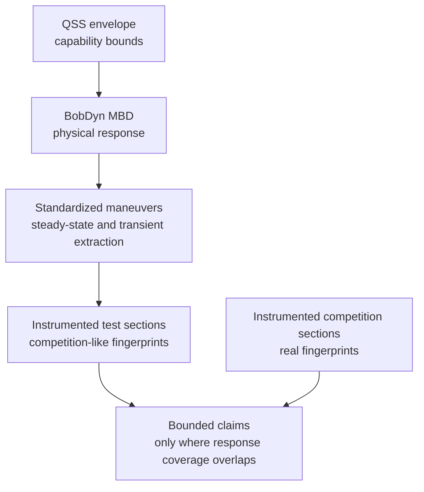

# FSAE Bridge

BobDyn is a high-fidelity vehicle analysis framework, not an FSAE-only tool —
but FSAE gives one of the clearest reasons it exists. Teams need a car that
performs well in a real competition, with limited time, limited test days,
thin instrumentation history, and only a few chances to see the car in a true
competition environment.

That makes this subtle: the team doesn't just need a fast car on paper. It
needs to understand capability, response, reliability, and driver interaction
well enough to make decisions under uncertainty. BobDyn reduces uncertainty
about the vehicle's physical response, and can support competition-focused
design — through a careful chain of evidence, not a direct leap from
simulation to points.

This page is for FSAE technical leads, vehicle dynamics groups, test leads, and
simulation users connecting design decisions to competition evidence. It
assumes comfort with basic vehicle dynamics and logged data, not a full
driver-in-the-loop or professional test infrastructure.

Read this alongside [Vehicle Dynamics](/reference/vehicle-dynamics): that page
covers what the physical system is, this one covers what a competition team
can responsibly claim about it. See
[What This Does Not Claim](#what-this-does-not-claim) for the explicit limits.

## The FSAE Challenge

FSAE performance combines vehicle capability, transient response, driver
execution, tire state, reliability, weather and surface conditions, event
operations, penalties, competitor performance, and the scoring system — it
doesn't reduce to one vehicle-response metric.

Lap simulation still helps: it exposes bottlenecks, compares assumptions, and
prioritizes design work. The problem isn't lap simulation itself — it's
treating a simulated lap time, a test-course lap time, or a points estimate as
proof of competition performance.

The better question is narrower: **what can the team justifiably claim about
the car's physical response, and where does that claim transfer to
competition?** That question costs something — model discipline, repeatable
tests, calibrated sensors, clean logs, and enough engineering time to compare
the same signals across simulation, testing, and competition. The framework
below spends that limited effort on claims that survive contact with real
data.

## Lap-Time Simulation As A Statistical Model

Treat lap time as a statistical model, not a single deterministic truth. The
simulation itself can be deterministic physics — a point-mass solver, QSS
envelope, optimal-control lap simulator, or multibody-derived reduced model —
but the decision-facing result should carry uncertainty, because the inputs
and context carry uncertainty:

$$
T \sim p(T \mid
x_{\text{vehicle}},
x_{\text{driver}},
x_{\text{track}},
x_{\text{surface}},
x_{\text{event}})
$$

where $T$ is lap time and the conditioning variables describe vehicle, driver,
track, surface, and event context.

In practice, a lap-time simulation should report:

- expected lap time or segment time
- uncertainty bands or percentiles
- sensitivity to tire, aero, mass, power, braking, and driver assumptions
- probability of beating a baseline, not only a nominal delta
- regions where the model has no validation coverage
- residual error against test and competition telemetry

That turns lap simulation into a decision tool instead of a claim machine — a
team can still use a nominal lap time, but reads it as one statistic from a
model, not the model's whole conclusion.

## Reduced Models Must Reflect The System

The core idea: a reduced-order model is a compressed view of the real
physical system, not a separate reality. QSS envelopes, lap-time tools, tire
abstractions, score sensitivity studies, and simple handling models all make a
claim about the real vehicle, and that claim only holds if the reduced model
preserves the parts of the system that matter for the question being asked.

For example:

- a QSS envelope must reflect the tire, aero, mass, power, and load-transfer behavior it summarizes
- a lap-time model must reflect the response regimes that actually appear on track
- a statistical lap-time model must reflect uncertainty in inputs, driver behavior, and event context
- a points model must reflect the uncertainty between vehicle performance and scored outcome
- a test-section comparison must reflect the physical states used in competition

If a reduced model no longer represents the original system in the region of
interest, it may still be convenient, but it isn't evidence. BobDyn keeps that
connection visible: the high-fidelity model, controlled tests, and telemetry
fingerprints anchor the reduced-order tools so they don't drift from the
vehicle they claim to represent.

## Evidence Levels

Simulation, test data, and competition outcomes don't connect in one simple
line — they connect through evidence levels, adopted in layers, each
supporting a different strength of claim:

| Level | Required evidence | What the team can claim |
| :-- | :-- | :-- |
| Simulation only | QSS and MBD with documented assumptions | design trends and predicted response, not competition transfer |
| Controlled test correlation | standardized steady-state and transient tests with measured signals | model agreement in the tested operating region |
| Competition telemetry | competition logs using the same signal set and definitions | local transfer claims where response fingerprints overlap |
| Repeated competition coverage | repeated section data, driver/context notes, and uncertainty estimates | stronger bounded claims with quantified residual uncertainty |

For a single-year team, the minimum viable version isn't a perfect simulation
program — it's:

1. keep a simple QSS envelope current,
2. run the high-fidelity model on the most important design questions,
3. log steering, speed, acceleration, yaw rate, throttle, and brake in testing,
4. repeat a small number of controlled steady-state and transient maneuvers,
5. log the same signals at competition,
6. compare only the sections and regimes the data actually cover.

Everything beyond that improves resolution — it doesn't change the basic
rule: claim only what the evidence covers.

## Core Workflow

Simulation shouldn't directly predict FSAE competition performance — it should
support a chain of evidence:

1. Quasi-steady-state analysis defines the operating envelope.
2. Multibody dynamics evaluates physical response inside that envelope.
3. Standardized steady-state and transient extraction maneuvers validate the response scientifically.
4. Instrumented test and competition data produce response-space fingerprints.
5. The team allows performance claims only where the fingerprints overlap.

This isn't a points model — it's a way to decide where test and simulation
evidence can support bounded claims about real competition sections.

## QSS Defines Capability

Quasi-steady-state analysis defines what the vehicle could do under
simplified equilibrium assumptions — combined longitudinal/lateral
acceleration limits, where tire, aero, power, or braking limits appear, which
speed ranges expose a bottleneck, and whether a design direction is worth
higher-fidelity analysis. It describes the operating envelope, not how the
full dynamic system enters, leaves, or feels inside those states.

## MBD Explains Response

BobDyn's multibody model evaluates the physical response inside that
envelope: geometry, compliance, inertia, transient tire behavior, steering,
load paths, damping, aero, and constraints become a time-domain vehicle
response. That matters because drivers don't experience an envelope plot —
they experience buildup, delay, overshoot, correction demand, stability,
saturation, and confidence.

BobDyn/BobLib and BobDyn/BobSim keep those response mechanisms visible:
engineers can inspect the model, teams can repeat the tests, signals stay
close to the metrics, and reports trace back to configuration and source.

## Standardized Maneuvers Validate Response

Before making competition claims, validate with controlled maneuvers. The
specific standard matters less than the practice: repeatable maneuvers that
extract steady-state and transient response comparably across simulation,
test, and future vehicle iterations. Two that work well for dynamic-system
correlation:

- ISO 4138-style steady-state response extraction
- ISO 7401-style transient steering response extraction

These don't prove a car will win — they validate pieces of the response model
under controlled conditions. If the model can't reproduce measured
steady-state and transient response in standardized maneuvers, don't trust it
to explain more complex competition sections.

## Fingerprints, Not Scaling

The most important distinction here: don't take a test-section lap time and
scale it to a competition lap time — that's a scaling problem, and usually the
wrong one. Instead, compare physical response-space fingerprints. A test
section supports a claim about a competition section only when the measured
vehicle response is sufficiently similar.

Useful fingerprint signals: lateral acceleration, yaw rate, yaw acceleration,
speed, steering input, throttle, brake, correction behavior — what the car and
driver actually did, not just how long the segment took.

A fingerprint isn't one number — it describes a section's response state using
time histories, distributions, and extracted features. A practical feature
vector:

$$
\phi =
\left[
a_y,\ r,\ \dot{r},\ V,\ \delta,\ \text{throttle},\ \text{brake},
\text{corrections},\ \text{utilization}
\right]
$$

where the exact entries depend on available sensors and the claim being made.
Define the feature vector before the comparison, so the similarity test
doesn't become a post-hoc justification.

Ways to check similarity:

- signal overlays for time-aligned or event-aligned sections
- histograms or density maps of speed, lateral acceleration, yaw rate, and inputs
- response-space occupancy maps such as $(V, a_y)$, $(a_y, r)$, or $(\delta, r)$
- normalized residuals between test and competition traces
- correction behavior such as steering reversals, correction energy, or driver input rate
- uncertainty bands from repeated runs when repeated data exist

"Sufficiently similar" isn't universal — define it for the claim. A lateral
capability claim cares most about speed, lateral acceleration, and tire
utilization. A driver-confidence or transient-stability claim cares more
about yaw-rate phase, correction behavior, and steering effort.

## Coverage Drives Uncertainty

Coverage bridges test data and competition claims. If a competition-like test
section covers the same response regimes as a real competition section, the
test data supports a stronger transfer claim; where coverage is weak or
absent, uncertainty grows and strong claims should be rejected:

| Situation | Claim quality |
| :-- | :-- |
| Test and competition fingerprints overlap tightly | Stronger local transfer claim |
| Similar speed and acceleration, but different correction behavior | Moderate claim with driver-layer uncertainty |
| Similar lap time, different response regimes | Weak claim |
| Competition region has no test coverage | No strong performance claim |

This doesn't pretend every test day predicts competition — it asks where the
physics are similar enough for a bounded claim. Refusal should leave a visible
record: mark a section as uncovered in the report, downgrade a result from a
transfer claim to an observation, exclude the section from points or lap-time
claims, add the missing regime to the next test plan, or report the model or
test as unvalidated in that region. Refusal isn't failure — it prevents false
confidence.

## Competition Data Matters

This depends on complete competition instrumentation. At minimum, log the same
response signals at competition as in testing: accelerations, yaw rate and
yaw acceleration, speed, steering, throttle, brake, time alignment, and
segment markers.

Without competition telemetry, the framework can still validate the vehicle
and compare test configurations, but can't confidently say which test
fingerprints matched real competition response. With competition telemetry,
even one year of data becomes far more valuable — the team can identify which
response regimes were actually used at competition, then focus future testing
and simulation on covering those regimes.

The minimum useful competition logger doesn't need exotic hardware, but it
does need consistency: preserve sensor calibration, channel names, units,
sample rates, filtering choices, and segment definitions between test and
competition. A comparison between incompatible logs is usually a workflow
problem before it's a vehicle dynamics problem.

## What This Does Not Claim

This framework does not claim that:

- simulation directly predicts FSAE points
- a competition-like course can be scaled into a competition lap time
- QSS envelopes are enough to design the car
- driver-in-the-loop is required for core validation
- a single competition year eliminates uncertainty

It claims something narrower: when measured response-space fingerprints
overlap sufficiently, test data can support statistically bounded performance
claims for similar competition sections. When coverage is weak, uncertainty
increases and the stack rejects strong claims. Without repeated data or a
clear uncertainty model, weaken the claim — the evidence can support an
engineering comparison, not a strong statistical bound.

## Driver Layer

Driver-in-the-loop and subjective-objective correlation sit above the core
validation stack. They add value by training drivers, reducing run-to-run
variance, exposing correction behavior, connecting subjective feedback to
measurable response metrics, and translating driver comments into setup
levers — but the core stack doesn't require them. A team can build a serious
QSS, MBD, standardized-maneuver, and telemetry-fingerprint workflow without
DIL.

That matters on a single-year timeline: DIL is powerful but consumes time,
infrastructure, and calibration effort. The core stack should stand on
measured vehicle response first.

## Accelerated Single-Year Path

For a team with one season of runway:

1. Build a QSS envelope to understand capability and bottlenecks.
2. Use BobDyn MBD to evaluate physical response inside that envelope.
3. Run standardized steady-state and transient extraction maneuvers.
4. Instrument competition-like test sections with complete telemetry.
5. Instrument real competition with the same telemetry package.
6. Compare response-space fingerprints by section.
7. Use overlap to make bounded local claims.
8. Treat uncovered regions as uncertainty, not as evidence.

The goal is faster learning with fewer unjustified assumptions, not perfect
prediction. People-hours are the real constraint, so prioritize:

1. define the few response claims that matter most,
2. make the logging and units reliable,
3. validate the model against controlled maneuvers,
4. compare a small number of competition-like sections,
5. only then expand the metric library or driver-layer analysis.

## What Winning Means Here

Designing a vehicle to win competition isn't the same as optimizing one
simulated lap. Winning requires capability, response quality, driver
confidence, reliability, repeatability, scoring awareness, and operational
execution.

BobDyn primarily helps with the physical capability and response-quality
pieces, and can support competition-relevant design decisions — while staying
honest about what the data actually prove. The mature claim: BobDyn helps
teams connect vehicle physics, controlled validation, and competition
telemetry so they can make better design decisions under real FSAE
constraints.
