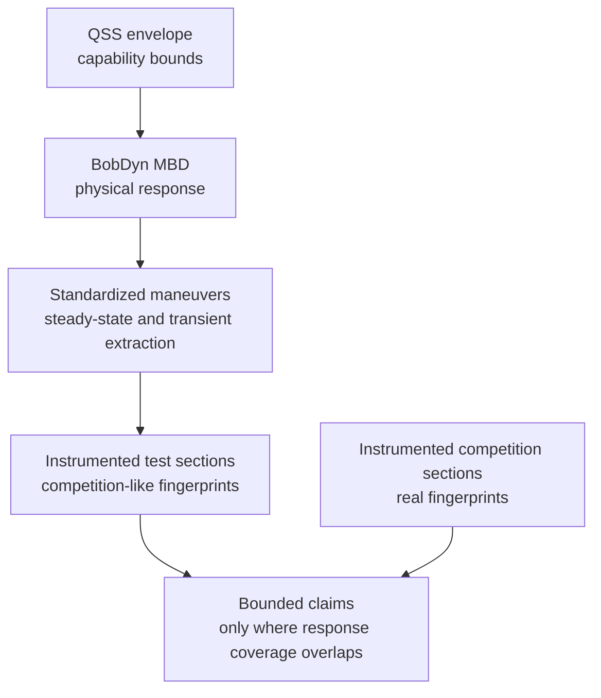

# FSAE Bridge

This page explains how an FSAE team can connect simulation, controlled tests,
and competition telemetry to claims about competition performance. The rule is
to claim only what the evidence covers.

BobDyn is not an FSAE-only tool. FSAE is a clear use case because teams have
limited time, few test days, thin instrumentation history, and few chances to
see the car in a real competition. The team must understand capability,
response, reliability, and driver interaction well enough to decide under
uncertainty. BobDyn reduces uncertainty about the vehicle's physical response.
It supports competition decisions through a chain of evidence, not a direct
jump from simulation to points.

The page is for technical leads, vehicle dynamics groups, test leads, and
simulation users. It assumes basic vehicle dynamics and logged data. It does
not assume driver-in-the-loop (DIL) or professional test infrastructure.

Related pages:

- [Vehicle Dynamics](/reference/vehicle-dynamics) explains the physical
  system. This page explains what a team can claim about it.
- [Plan a Single-Season Validation](/reference/fsae-season-plan) gives the
  steps to apply this page in one season.
- [What this does not claim](#what-this-does-not-claim) lists the limits.

## The FSAE problem

FSAE performance combines vehicle capability, transient response, driver
execution, tire state, reliability, weather and surface, event operations,
penalties, competitor performance, and the scoring system. No single
vehicle-response metric captures it.

Lap simulation helps. It exposes bottlenecks, compares assumptions, and ranks
design work. The error is to treat a simulated lap time, a test-course lap
time, or a points estimate as proof of competition performance.

Ask a narrower question: **what can the team justifiably claim about the car's
physical response, and where does that claim transfer to competition?** The
answer costs model discipline, repeatable tests, calibrated sensors, clean
logs, and engineering time to compare the same signals across simulation,
testing, and competition. The framework below spends that effort on claims
that hold up against real data.

## Lap time as a statistical model

Treat lap time as a statistical model, not one deterministic answer. The
simulation can be deterministic physics: a point-mass solver, a QSS envelope,
an optimal-control lap simulator, or a reduced model derived from multibody
dynamics. The inputs and context are uncertain, so the result you decide on
should carry that uncertainty:

$$
T \sim p(T \mid
x_{\text{vehicle}},
x_{\text{driver}},
x_{\text{track}},
x_{\text{surface}},
x_{\text{event}})
$$

$T$ is lap time. The conditioning variables describe vehicle, driver, track,
surface, and event context.

A lap-time simulation should report:

- expected lap time or segment time
- uncertainty bands or percentiles
- sensitivity to tire, aero, mass, power, braking, and driver assumptions
- probability of beating a baseline, not only a nominal delta
- regions where the model has no validation coverage
- residual error against test and competition telemetry

A nominal lap time is still useful. Read it as one statistic from a model, not
as the model's conclusion.

## Reduced models must reflect the system

A reduced-order model is a compressed view of the physical system. QSS
envelopes, lap-time tools, tire abstractions, score sensitivity studies, and
simple handling models all make a claim about the real vehicle. That claim
holds only if the reduced model keeps the parts of the system that matter for
the question.

| Reduced model | Must reflect |
| :-- | :-- |
| QSS envelope | the tire, aero, mass, power, and load-transfer behavior it summarizes |
| Lap-time model | the response regimes that appear on track |
| Statistical lap-time model | uncertainty in inputs, driver behavior, and event context |
| Points model | the uncertainty between vehicle performance and scored outcome |
| Test-section comparison | the physical states used in competition |

If a reduced model no longer represents the system in the region of interest,
it may still be convenient, but it is not evidence. In BobDyn, the
high-fidelity model, controlled tests, and telemetry fingerprints anchor the
reduced-order tools to the vehicle they represent.

## Evidence levels

Simulation, test data, and competition outcomes connect through evidence
levels. A team adopts them in layers. Each level supports a different strength
of claim:

| Level | Required evidence | What the team can claim |
| :-- | :-- | :-- |
| Simulation only | QSS and MBD with documented assumptions | design trends and predicted response, not competition transfer |
| Controlled test correlation | standardized steady-state and transient tests with measured signals | model agreement in the tested operating region |
| Competition telemetry | competition logs using the same signal set and definitions | local transfer claims where response fingerprints overlap |
| Repeated competition coverage | repeated section data, driver/context notes, and uncertainty estimates | stronger bounded claims with quantified residual uncertainty |

More evidence improves resolution. It does not change the rule: claim only
what the evidence covers.

## The evidence chain

Simulation does not predict competition performance directly. It supports a
chain of evidence. QSS defines the envelope. MBD evaluates response inside it.
Standardized maneuvers validate that response. Instrumented test and
competition data produce response-space fingerprints. The team makes a claim
only where the fingerprints overlap.

This is not a points model. It decides where test and simulation evidence
support bounded claims about real competition sections.

### QSS defines capability

Quasi-steady-state analysis shows what the vehicle could do under simplified
equilibrium assumptions:

- combined longitudinal and lateral acceleration limits
- where tire, aero, power, or braking limits appear
- which speed ranges expose a bottleneck
- whether a design direction is worth higher-fidelity analysis

QSS describes the operating envelope. It does not describe how the full
dynamic system enters, leaves, or feels inside those states.

### MBD explains response

BobDyn's multibody model evaluates the physical response inside the envelope.
Geometry, compliance, inertia, transient tire behavior, steering, load paths,
damping, aero, and constraints become a time-domain vehicle response. Drivers
do not feel an envelope plot. They feel buildup, delay, overshoot, correction
demand, stability, saturation, and confidence.

BobDyn/BobLib and BobDyn/BobSim keep those response mechanisms visible.
Engineers can inspect the model. Teams can repeat the tests. Signals stay close
to the metrics, and reports trace back to configuration and source.

### Standardized maneuvers validate response

Validate the model with controlled maneuvers before you make competition
claims. The specific standard matters less than repeatable maneuvers that
extract steady-state and transient response the same way across simulation,
test, and later vehicles. Two work well for dynamic-system correlation:

- ISO 4138-style steady-state response extraction
- ISO 7401-style transient steering response extraction

These maneuvers do not prove a car will win. They validate parts of the
response model under controlled conditions. If the model cannot reproduce
measured response in standardized maneuvers, do not trust it to explain more
complex competition sections.

### Fingerprints, not scaling

Do not scale a test-section lap time to a competition lap time. Compare
physical response-space fingerprints instead. A test section supports a claim
about a competition section only when the measured vehicle response is
sufficiently similar.

Useful fingerprint signals are lateral acceleration, yaw rate, yaw
acceleration, speed, steering input, throttle, brake, and correction behavior.
They record what the car and driver did, not only how long the segment took.

A fingerprint describes a section's response state with time histories,
distributions, and extracted features. A practical feature vector:

$$
\phi =
\left[
a_y,\ r,\ \dot{r},\ V,\ \delta,\ \text{throttle},\ \text{brake},
\text{corrections},\ \text{utilization}
\right]
$$

The exact entries depend on the available sensors and the claim. Define the
feature vector before the comparison, so the similarity test does not become
a post-hoc justification.

Ways to check similarity:

- signal overlays for time-aligned or event-aligned sections
- histograms or density maps of speed, lateral acceleration, yaw rate, and inputs
- response-space occupancy maps such as $(V, a_y)$, $(a_y, r)$, or $(\delta, r)$
- normalized residuals between test and competition traces
- correction behavior such as steering reversals, correction energy, or driver input rate
- uncertainty bands from repeated runs when repeated data exist

Define "sufficiently similar" for each claim. A lateral capability claim
depends most on speed, lateral acceleration, and tire utilization. A
driver-confidence or transient-stability claim depends more on yaw-rate phase,
correction behavior, and steering effort.

## Coverage drives uncertainty

Coverage connects test data to competition claims. When a test section covers
the same response regimes as a competition section, the test data supports a
stronger transfer claim. Where coverage is weak or absent, uncertainty grows
and you should reject strong claims.

| Situation | Claim quality |
| :-- | :-- |
| Test and competition fingerprints overlap tightly | Stronger local transfer claim |
| Similar speed and acceleration, but different correction behavior | Moderate claim with driver-layer uncertainty |
| Similar lap time, different response regimes | Weak claim |
| Competition region has no test coverage | No strong performance claim |

A rejected claim should leave a visible record. You can:

- mark the section as uncovered in the report
- downgrade the result from a transfer claim to an observation
- exclude the section from points or lap-time claims
- add the missing regime to the next test plan
- report the model or test as unvalidated in that region

A rejected claim is not a failure. It prevents false confidence.

## Competition data

The framework needs complete competition instrumentation. At minimum, log the
same response signals at competition as in testing: accelerations, yaw rate
and yaw acceleration, speed, steering, throttle, brake, time alignment, and
segment markers.

Without competition telemetry, the framework can still validate the vehicle
and compare test configurations. It cannot say with confidence which test
fingerprints matched real competition response. With competition telemetry,
even one year of data shows which response regimes the car used at
competition. Future testing and simulation can then focus on those regimes.

The logger does not need exotic hardware, but it needs consistency. Keep
sensor calibration, channel names, units, sample rates, filtering choices, and
segment definitions the same between test and competition. A comparison
between incompatible logs is usually a workflow problem before it is a vehicle
dynamics problem.

## Driver layer

DIL and subjective-objective correlation sit above the core validation stack.
They help to:

- train drivers
- reduce run-to-run variance
- expose correction behavior
- connect subjective feedback to measurable response metrics
- translate driver comments into setup changes

The core stack does not require them. A team can build a QSS, MBD,
standardized-maneuver, and telemetry-fingerprint workflow without DIL. On a
single-year timeline this matters, because DIL costs time, infrastructure, and
calibration effort. The core stack should rest on measured vehicle response
first.

## What this does not claim

This framework does not claim that:

- simulation directly predicts FSAE points
- a competition-like course can be scaled into a competition lap time
- QSS envelopes are enough to design the car
- driver-in-the-loop is required for core validation
- a single competition year eliminates uncertainty

It claims something narrower. When measured response-space fingerprints
overlap sufficiently, test data can support statistically bounded performance
claims for similar competition sections. When coverage is weak, uncertainty
increases and the stack rejects strong claims. Without repeated data or a
clear uncertainty model, weaken the claim: the evidence can support an
engineering comparison, not a strong statistical bound.

## What winning requires

Designing a car to win is not the same as optimizing one simulated lap.
Winning requires capability, response quality, driver confidence,
reliability, repeatability, scoring awareness, and operational execution.

BobDyn helps most with physical capability and response quality. It connects
vehicle physics, controlled validation, and competition telemetry so a team
can make better design decisions under FSAE constraints, and it stays honest
about what the data prove.
