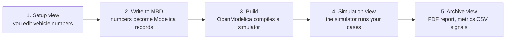

# BobDyn/BobSim Startup

This tutorial takes you from a fresh clone to one finished simulation. At the
end you have the BobSim app open, a vehicle saved and written to the Modelica
stack, one run complete, and a PDF report to read.

You need Git, Make, and Docker. The app and every simulation run inside the
BobSim Docker image, which contains OpenModelica and Python. To run without
Docker, see [Run BobSim Without Docker](/startup-guide/bobsim-without-docker).

## How BobSim Works

BobSim does not simulate anything itself. It turns your vehicle numbers into
Modelica code, has OpenModelica compile it, runs the compiled program, and
collects the results.



<details class="diagram-text">
<summary>Text version</summary>

1. Setup view: you edit vehicle numbers.
2. Write to MBD: the numbers become Modelica records.
3. Build: OpenModelica compiles a simulator.
4. Simulation view: the simulator runs your cases.
5. Archive view: PDF report, metrics CSV, signals.

</details>

The app locks each step until the one before it is done. The left rail has four
views:

| View | What it is for |
| :-- | :-- |
| `Setup` | Define the vehicle: architecture, geometry, mass, suspension, tires, aero, powertrain |
| `Simulation` | Configure and launch a study against the current vehicle |
| `Replay` | Play back a captured run in 3D: suspension geometry, tire loads, and grip |
| `Archive` | Download reports, metrics, and signal data from finished runs |

`Replay` is not part of the chain. It shows scenes that you capture separately.
See [Replay a captured run](/use-guide/bobsim#replay-a-captured-run).

## Install What BobSim Needs

| Tool | Why |
| :-- | :-- |
| Git | Clone BobSim and its BobLib submodule |
| GNU Make | Every workflow is a `make` target |
| Docker with Docker Compose | The app and the `make` targets run inside the BobSim image |

The image is built from `openmodelica/openmodelica:v1.26.3-ompython`. It
installs the exact Modelica libraries BobLib needs (Modelica `4.1.0` and
VehicleInterfaces `2.0.2`) and the Python packages in `requirements.txt`. It
builds on x86_64 and on ARM64 hosts, including Apple Silicon.

## Step 1: Clone BobSim

Clone with submodules. BobSim vendors BobDyn/BobLib at
`_0_Utils/external/BobLib/`.

```bash
git clone --recurse-submodules https://github.com/BobDyn/BobSim.git
cd BobSim
make init
```

`make init` runs `git submodule update --init --recursive`. Do not skip it.
Without BobLib every Modelica build fails.

::: info Where commands run
Run every command in this guide from the BobSim repository root, the directory
the clone step created.
:::

## Step 2: Build The Docker Image

```bash
make docker-build
```

This builds the `bobdyn/bobsim:latest` image. The first build downloads the
OpenModelica base image and can take some time. Later builds reuse it.

To list every target with a description, run `make help`.

## Step 3: Launch The App

```bash
make app
```

The terminal prints:

```text
BobSim app in Docker. Open http://127.0.0.1:8765
...
BobSim app running at http://0.0.0.0:8765
```

Open `http://127.0.0.1:8765`. The second line is the address inside the
container. Docker publishes the port on `127.0.0.1` only, so other machines on
your network cannot see the app.

To stop the app, press `Ctrl+C` in the same terminal. This also removes the
container. To use a different port, run `make app APP_PORT=8766`.

The repository directory is mounted into the container. Everything the app
saves lands in your checkout.

## Step 4: Confirm OpenModelica

Click `OpenModelica` in the top bar to open the `Toolchain` dialog. In Docker
it shows `omc` as `/usr/bin/omc` and `Libraries` as
`/root/.openmodelica/libraries`. The app finds both automatically. You do not
need to change or save anything.

## Step 5: Choose A Vehicle

The first screen is the vehicle dialog.


| Path | Use it when |
| :-- | :-- |
| `Load Vehicle` | You already saved a vehicle in this app |
| `Create Vehicle` | You want a new vehicle from a checked-in architecture template |
| `Import YAML` | You have a vehicle YAML file from somewhere else |
| `Continue Active File` | You want to keep working from the repo's active `vehicle.yml` |

For a first run, select `Create Vehicle`. Choose a template, type a name, and
click the button. Templates are named `<front>_<rear>` by suspension
architecture, for example `DWBC_DWBCRecord`.

## Step 6: Work Through Setup

Setup has eight steps. The tabs across the top are numbered, and `Next` and
`Previous` go through them in order:

1. Architecture
2. Geometry
3. Mass
4. Suspension
5. Compliances
6. Tires
7. Aero
8. Powertrain

The left pane is the editor. The right pane is a live preview of what the
current step affects. The `?` button beside the editor title opens the app's
notes for that step: what it is for, what the preview shows, and what to check
before you continue.


The Tires step also takes `.tir` files. It redraws its pure and combined slip
load maps from the active tire as you edit.


You do not have to finish all eight steps before you simulate. A template is
already internally consistent, so you can run it unchanged the first time.

## Step 7: Save And Write To MBD

Use the two buttons at the bottom of the left rail, in this order:

1. Click `Save Vehicle`.
2. Click `Write to MBD`.

`Write to MBD` writes the vehicle as Modelica records into the BobLib
submodule, under `BobLib/Records/VehicleDefn/`. The status strip in the top bar
tracks the chain from [How BobSim Works](#how-bobsim-works):

| Status | Meaning |
| :-- | :-- |
| `BobLib` | The BobLib submodule is present |
| `Vehicle Definition` | The saved vehicle has been written to the Modelica stack |
| `VehicleSim` | The RampSteer/SteadyState/Transient build is ready, missing, or stale |
| `FourPostSim` | The four-post build is ready, missing, or stale |

If `Write to MBD` is greyed out, hover over it. The button states its reason.
The usual reasons and fixes are:

| Reason shown | Fix |
| :-- | :-- |
| *Initialize the BobLib submodule first* | Run `make init` |
| *Save this vehicle config before writing to MBD* | Click `Save Vehicle` |
| *Vehicle definition is already current in MBD* | Nothing. Continue to the next step. |

## Step 8: Run Your First Simulation

Open `Simulation`.


| Card | Use it for |
| :-- | :-- |
| `Ramp Steer` | Open-loop steering ramp response |
| `Steady State` | Settled lateral-acceleration operating points |
| `Transient` | Step and sine steering response |
| `Four Post` | Heave, roll, and vertical-force suspension procedures |

Each card says what the run does, which parameters matter, and what it
produces. For a first run, use `Ramp Steer`:

1. Click `Configure`.
2. Read the run fields. Do not change them yet.
3. Click `Build + Run RampSteerEval`.
4. Open the `Run Log` tab to watch progress.
5. Click `Review` when the run finishes.

The first build is slow because OpenModelica compiles the whole vehicle model.
Later runs reuse the build until the vehicle definition changes. The
`VehicleSim` and `FourPostSim` status lights show when that happens.

If you edit a config field, the run button changes to `Apply + Build + Run`.
Click `Apply Edits` first, or let the run button apply them for you.


## Step 9: Review The Results

Open `Archive`, or click `Review` on the workflow card.


Every successful run becomes an archive package that you can download:

| File | Contents |
| :-- | :-- |
| PDF report | The generated report. You can preview it in the browser. |
| Metrics CSV | The scalar metrics for the run |
| `signals.zip` | A `manifest.json` and one folder per run with `signals.csv`, `overrides.txt`, `run.log`, and `description.json` |
| `run-description.json` | A description of the run |
| `vehicle.yml`, `config.yml` | Snapshots of the vehicle and study config that produced the run |

FourPostEval leaves raw time-series appendix pages out of its PDF by default
(`raw_time_series_appendix: false`) to keep the K&C report short.

`Delete` removes a package from both the global archive and the vehicle
workspace.

You now have a working setup. If a step failed, see
[BobSim Startup Problems](/startup-guide/bobsim-troubleshooting).

## Next Pages

- [BobSim Use Guide](/use-guide/bobsim) for the daily app workflow and where
  BobSim puts your files
- [BobSim CLI Workflow](/use-guide/bobsim-cli) to run the same studies from
  `make` targets
- [Run BobSim Without Docker](/startup-guide/bobsim-without-docker) for the
  host app and the released desktop app
- [BobSim App](/bobsim/app) for a full tour of the app views
- [StandardSim](/bobsim/standard-sim) for the evaluation details
- [Configuration](/bobsim/configuration) for YAML and build details
