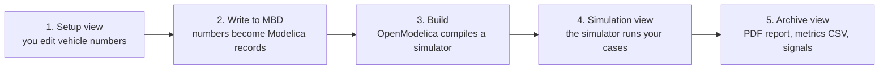

# BobDyn/BobSim Startup

By the end of this page you will have the BobSim app open, a vehicle saved,
that vehicle written into the Modelica stack, one simulation run, and a PDF
report to look at.

Budget about 30 minutes the first time. Most of it is installing OpenModelica.

## How BobSim Works

BobSim never simulates anything itself. It turns your vehicle numbers into
Modelica code, hands that to OpenModelica to compile, runs the compiled
program, and collects what comes back.



That chain is why the app locks each step until the one before it is done. The
three buttons in the left rail map onto it directly:

| View | What it is for |
| :-- | :-- |
| `Setup` | Define the vehicle: architecture, geometry, mass, suspension, tires, aero, powertrain |
| `Simulation` | Configure and launch a study against the current vehicle |
| `Archive` | Download reports, metrics, and signal data from finished runs |

::: tip Use the app first
The app is the recommended path. It guides setup, shows what the Modelica stack
is missing, and keeps runs and their results keyed together.

The CLI targets do the same work for scripting and CI. They are covered in
[The CLI Path](#the-cli-path) near the bottom.
:::

## Install What BobSim Needs

### OpenModelica And Two Libraries

Required to build or run any simulation. Setup work happens without it, but
`Simulation` stays locked.

Install [OpenModelica](https://openmodelica.org/download/), then add the two
libraries BobLib is compiled against. Open the OpenModelica shell (`omc`) or
OMEdit and run:

```text
installPackage(Modelica, "4.1.0", exactMatch=true);
installPackage(VehicleInterfaces, "2.0.2", exactMatch=true);
```

::: warning The versions are exact
The BobLib build scripts call `loadModel(Modelica, {"4.1.0"})` and
`loadModel(VehicleInterfaces, {"2.0.2"})`. Any other version fails the build,
and the app's toolchain check reports the library as missing.
:::

### Python 3.11 And Git

Only needed for the source checkout. The released desktop app bundles its own
Python. BobSim is developed and tested on Python 3.11.

### Docker And Docker Compose

Only needed for the containerized CLI workflow. Every `make` simulation target
runs inside the container by default. You can opt out per target with `RUN=`,
which is what CI does. See [The CLI Path](#the-cli-path).

## Step 1: Get BobSim

Choose one.

### Released Desktop App

Download the asset for your operating system from the
[GitHub Release](https://github.com/BobDyn/BobSim/releases/latest), extract it,
and run `BobSim` (`BobSim.exe` on Windows). Assets are named
`BobSim-<version>-<platform>` and ship as `.zip` on Windows and macOS,
`.tar.gz` on Linux.

The desktop app starts the same local server the source checkout does, picks a
free port automatically, and opens it in an embedded window. If that window is
unavailable it falls back to your default browser.

### Source Checkout

Clone with submodules. BobSim vendors BobDyn/BobLib at
`_0_Utils/external/BobLib/`.

```bash
git clone --recurse-submodules https://github.com/BobDyn/BobSim.git
cd BobSim
```

If you already cloned without `--recurse-submodules`, run this from the BobSim
root:

```bash
make init
```

Then create a Python environment and install the dependencies:

```bash
python -m venv .venv
source .venv/bin/activate
python -m pip install --upgrade pip
python -m pip install -r requirements.txt
```

On Windows PowerShell, activate with `.venv\Scripts\Activate.ps1` instead.

Check that both halves are in place:

```bash
python -c "import yaml, scipy, pandas, matplotlib; print('python deps ok')"
omc --version
```

`omc --version` failing is not fatal. You can still do setup work; the app will
ask you to locate OpenModelica before it unlocks `Simulation`.

::: info Where commands run
Everything in this guide runs from the BobSim repository root, the directory
the clone step created.
:::

## Step 2: Launch The App

Released desktop app: run `BobSim`.

Source checkout:

```bash
make app
```

The terminal prints:

```text
BobSim app running at http://127.0.0.1:8765
```

Open that address. Stop the app with `Ctrl+C` in the same terminal.

To use a different port:

```bash
python -m _5_App.app --port 8766
```

## Step 3: Point BobSim At OpenModelica

Click `OpenModelica` in the top bar to open the toolchain dialog.

`Auto` searches the usual install locations and fills both fields for you.
Start there. If auto-detection comes up empty, set them by hand:

- **omc executable**: `omc.exe` on Windows, `omc` elsewhere
- **library directory**: where `installPackage` put Modelica and
  VehicleInterfaces

| Platform | Typical library directory |
| :-- | :-- |
| Windows | `%APPDATA%\.openmodelica\libraries` |
| macOS | `~/.openmodelica/libraries` |
| Linux | `~/.openmodelica/libraries` |

Click `Save`. BobSim checks that the executable runs and that both required
libraries are present, and names the missing one if not.

You can skip this step for now and come back to it before Step 7.

## Step 4: Choose A Vehicle

The first screen is the vehicle dialog.


| Path | Use it when |
| :-- | :-- |
| `Load Vehicle` | You already saved a vehicle in this app |
| `Create Vehicle` | You want a fresh vehicle from a checked-in architecture template |
| `Import YAML` | You have a vehicle YAML file from somewhere else |
| `Continue Active File` | You want to keep working from the repo's active `vehicle.yml` |

For a first run, pick `Create Vehicle`: choose a template, type a name, and
click the button. Templates are named `<front>_<rear>` by suspension
architecture, for example `DWBC_DWBCRecord`.

## Step 5: Work Through Setup

Setup has eight steps. The tabs across the top are numbered, and `Next` and
`Previous` walk them in order:

1. Architecture
2. Geometry
3. Mass
4. Suspension
5. Compliances
6. Tires
7. Aero
8. Powertrain

The left pane is the editor, the right pane is a live preview of whatever the
current step affects. The `?` button beside the editor title opens the app's
own notes for that step: what it is for, what the preview shows, and what to
sanity-check before moving on.


The Tires step also takes `.tir` files and redraws its pure and combined slip
load maps from the active tire as you edit.


You do not have to finish all eight steps before simulating. A template is
already internally consistent, so you can run it as-is the first time.

## Step 6: Save And Write To MBD

Two buttons at the bottom of the left rail, in this order:

1. Click `Save Vehicle`.
2. Click `Write to MBD`.

The status strip in the top bar tracks the chain from
[How BobSim Works](#how-bobsim-works):

| Status | Meaning |
| :-- | :-- |
| `BobLib` | The BobLib submodule is present |
| `Vehicle Definition` | The saved vehicle has been written to the Modelica stack |
| `VehicleSim` | The RampSteer/SteadyState/Transient build is ready, missing, or stale |
| `FourPostSim` | The four-post build is ready, missing, or stale |

If `Write to MBD` is greyed out, hover it. The button states its own reason,
and the fix is usually one of:

- *Initialize the BobLib submodule first* — run `make init`
- *Save this vehicle config before writing to MBD* — click `Save Vehicle`
- *Vehicle definition is already current in MBD* — nothing to do, move on

## Step 7: Run Your First Simulation

Open `Simulation`.


| Card | Use it for |
| :-- | :-- |
| `Ramp Steer` | Open-loop steering ramp response |
| `Steady State` | Settled lateral-acceleration operating points |
| `Transient` | Step and sine steering response |
| `Four Post` | Heave, roll, and vertical-force suspension procedures |

Each card explains what the run does, which parameters matter, and what it
produces. For a first proof run, take `Ramp Steer`:

1. Click `Configure`.
2. Read the run fields. Change nothing yet.
3. Click `Build + Run RampSteerEval`.
4. Switch to the `Run Log` tab and watch.
5. Click `Review` when it finishes.

The first build is slow: OpenModelica is compiling the whole vehicle model.
Later runs reuse it unless the vehicle definition changed, which is what the
`VehicleSim` and `FourPostSim` status lights are telling you.

If you edit a config field, the run button becomes `Apply + Build + Run`.
Either click `Apply Edits` first, or let the run button apply them for you.


## Step 8: Review The Results

Open `Archive`, or click `Review` on the workflow card.


Every successful run becomes an archive package you can download:

- the generated PDF report, previewable in the browser
- the metrics CSV
- `signals.zip`, holding one folder per run with `signals.csv`,
  `overrides.txt`, `run.log`, and `description.json`
- `run-description.json`, the manifest for the whole package

FourPostEval leaves raw time-series appendix pages out of its PDF by default
(`raw_time_series_appendix: false`) so the K&C report stays readable.

`Delete` removes a package from both the global archive and the vehicle
workspace.

## Where BobSim Puts Your Files

Everything the app generates lives under `_5_App/user_data/`:

| Path | Contents |
| :-- | :-- |
| `_5_App/user_data/config/vehicles/` | Saved vehicles, one YAML per vehicle |
| `_5_App/user_data/config/simulations/` | Saved simulation configs |
| `_5_App/user_data/config/app/` | App settings, including the OpenModelica toolchain choice |
| `_5_App/user_data/results/saved/` | Archive packages |
| `_5_App/user_data/workspaces/vehicles/<vehicle>/` | Per-vehicle builds, results, and processing |
| `_5_App/user_data/cache/` | Modelica build cache |

Reports and metric CSVs from the standard studies are written to
`_3_StandardSim/generated_results/` before the app copies them into an archive
package.

The released desktop app keeps that same tree inside a per-user runtime root
instead of the repository:

| Platform | Runtime root |
| :-- | :-- |
| Windows | `%LOCALAPPDATA%\BobDyn\BobSim` |
| macOS | `~/Library/Application Support/BobDyn/BobSim` |
| Linux | `${XDG_DATA_HOME:-~/.local/share}/BobDyn/BobSim` |

Set `BOBSIM_HOME` to put it somewhere else. A source checkout ignores all of
this and works inside the repository directory.

## The CLI Path

Use the CLI for scripted runs, CI, and reproducible builds. The simulation
targets run inside Docker, so build the image once:

```bash
make docker-build
```

List every target with a description:

```bash
make help
```

Run the whole StandardSim baseline, building what is missing first:

```bash
make standard-eval-all
```

Or one study at a time:

```bash
make standard-build
make standard-eval-ramp-steer
make standard-eval-steady-state
make standard-eval-transient

make standard-build-four-post
make standard-eval-four-post
```

Envelope and sensitivity workflows:

```bash
make envelope-all
make opt-standard
make opt-envelope
make opt-refined
```

Lint, typecheck, and tests:

```bash
make ci
```

::: tip Skipping Docker
`RUN=` empties the Docker prefix and runs a target directly in your current
environment. GitHub Actions uses exactly this for the fast gate:

```bash
make lint RUN=
make typecheck RUN=
make test RUN=
```

The simulation targets run this way too, but then they need a working `omc` on
the host.
:::

## Common Problems

### No module named yaml

The app is running in an environment without the dependencies. Install them
into the same interpreter that launches it:

```bash
python -m pip install -r requirements.txt
```

### BobLib submodule missing

```bash
make init
```

### Simulation is locked

Hover the locked control; it names the reason. In order, the app wants the
vehicle saved, then written to MBD, then a verified OpenModelica toolchain.

### omc: command not found

Open the `OpenModelica` dialog in the top bar and click `Auto`, or set the
`omc` path by hand. For CLI work, install OpenModelica locally or use the
Docker targets, which bring their own.

### Toolchain saved but a library is reported missing

Confirm the exact versions are installed, from
[OpenModelica And Two Libraries](#openmodelica-and-two-libraries):

```text
installPackage(Modelica, "4.1.0", exactMatch=true);
installPackage(VehicleInterfaces, "2.0.2", exactMatch=true);
```

### Executable not found, or Init XML not found

Nothing has been compiled yet. Use `Build + Run` in the app, or:

```bash
make standard-build
make standard-build-four-post
```

### A run failed and you want the raw directory

It is already there. All four shipped configs set `execution.cleanup: false`,
so run directories are kept under the build directory:

```text
_3_StandardSim/BuildBobLib/VehicleSim/results/run_<id>/
_3_StandardSim/BuildBobLib/FourPostSim/results/run_<id>/
```

Each holds `run.log`, `overrides.txt`, the raw result CSV, and a manifest. If
the directory is gone, something set `execution.cleanup: true` in that config;
set it back to `false` and rerun.

## Next Pages

- [BobSim App](/bobsim/app) for a full tour of Setup, Simulation, and Archive
- [BobSim Use Guide](/use-guide/bobsim) for the normal workflow after setup
- [BobDyn/BobSim overview](/bobsim/) for the repo map and CLI target language
- [StandardSim](/bobsim/standard-sim) for the high-fidelity evaluation details
- [Configuration](/bobsim/configuration) for YAML and build details
