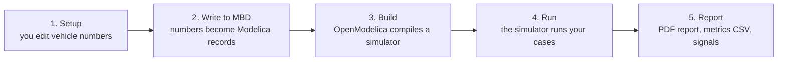

# BobDyn/BobSim Startup

By the end of this page you will have built the BobSim Docker image, run one
standard study, and opened its PDF report. You will then open the BobSim app to
edit a vehicle and run the studies again against it.

You need only Git, Make, and Docker. You do not install OpenModelica. The
BobSim Docker image contains it.

## How BobSim Works

BobSim never simulates anything itself. It turns your vehicle numbers into
Modelica code, hands that to OpenModelica to compile, runs the compiled
program, and collects what comes back.



<details class="diagram-text">
<summary>Text version</summary>

1. Setup: you edit vehicle numbers.
2. Write to MBD: the numbers become Modelica records.
3. Build: OpenModelica compiles a simulator.
4. Run: the simulator runs your cases.
5. Report: PDF report, metrics CSV, signals.

</details>

The `make` targets do steps 3 to 5 inside Docker. The app does steps 1 and 2.

## Install What BobSim Needs

| Tool | Why |
| :-- | :-- |
| Git | Clone BobSim and its BobLib submodule |
| GNU Make | Every workflow is a `make` target |
| Docker with Docker Compose | The `make` targets run inside the BobSim image |
| Python 3.11 | Only for `make app`, which runs on your machine, not in Docker |

The image is built from `openmodelica/openmodelica:v1.26.3-ompython`. It
installs the exact Modelica libraries BobLib needs (Modelica `4.1.0` and
VehicleInterfaces `2.0.2`) and the Python packages in `requirements.txt`. It
builds on x86_64 and on ARM64 hosts, including Apple Silicon.

## Step 1: Clone BobSim

Clone with submodules. BobSim vendors BobDyn/BobLib at
`_0_Utils/external/BobLib/`.

```bash
git clone --recurse-submodules https://github.com/BobDyn/BobSim.git
cd BobSim
make init
```

`make init` runs `git submodule update --init --recursive`. Do not skip it.
Without BobLib every Modelica build fails.

::: info Where commands run
Everything in this guide runs from the BobSim repository root, the directory
the clone step created.
:::

## Step 2: Build The Docker Image

```bash
make docker-build
```

This builds the `bobdyn/bobsim:latest` image. The first build downloads the
OpenModelica base image and can take some time. Later builds reuse it.

List every target with a description:

```bash
make help
```

## Step 3: Run Your First Study

```bash
make standard-eval-ramp-steer
```

This target first runs `make standard-build`, which compiles the BobLib
`VehicleSim` model with OpenModelica inside the container. The first build is
slow because it compiles the whole vehicle model. Later runs reuse the build
unless the vehicle records or the model change.

When it finishes, open the report:

```text
_3_StandardSim/generated_results/ramp_steer_eval_report.pdf
```

The metrics CSV is written to the same folder.

Run the other studies the same way:

| Target | Study |
| :-- | :-- |
| `make standard-eval-ramp-steer` | Open-loop steering ramp response |
| `make standard-eval-steady-state` | Settled lateral-acceleration operating points |
| `make standard-eval-transient` | Step and sine steering response |
| `make standard-eval-four-post` | Heave, roll, and vertical-force suspension procedures |
| `make standard-eval-all` | All four |

`make standard-eval-four-post` builds `FourPostSim` first with
`make standard-build-four-post`.

## Step 4: Open The App

The app is where you edit the vehicle. It runs on your machine, so it needs a
Python environment with the BobSim dependencies:

```bash
python -m venv .venv
source .venv/bin/activate
python -m pip install --upgrade pip
python -m pip install -r requirements.txt
make app
```

On Windows PowerShell, activate with `.venv\Scripts\Activate.ps1` instead.

The terminal prints:

```text
BobSim app running at http://127.0.0.1:8765
```

Open that address. Stop the app with `Ctrl+C` in the same terminal. To use a
different port, run `python -m _5_App.app --port 8766`.

The left rail has four views:

| View | What it is for |
| :-- | :-- |
| `Setup` | Define the vehicle: architecture, geometry, mass, suspension, tires, aero, powertrain |
| `Simulation` | Configure and launch a study from the app |
| `Replay` | Play back a captured run in 3D: suspension geometry, tire loads, and grip |
| `Archive` | Download reports, metrics, and signal data from finished runs |

## Step 5: Choose A Vehicle

The first screen is the vehicle dialog.


| Path | Use it when |
| :-- | :-- |
| `Load Vehicle` | You already saved a vehicle in this app |
| `Create Vehicle` | You want a fresh vehicle from a checked-in architecture template |
| `Import YAML` | You have a vehicle YAML file from somewhere else |
| `Continue Active File` | You want to keep working from the repo's active `vehicle.yml` |

For a first run, pick `Create Vehicle`: choose a template, type a name, and
click the button. Templates are named `<front>_<rear>` by suspension
architecture, for example `DWBC_DWBCRecord`.

## Step 6: Work Through Setup

Setup has eight steps. The tabs across the top are numbered, and `Next` and
`Previous` walk them in order:

1. Architecture
2. Geometry
3. Mass
4. Suspension
5. Compliances
6. Tires
7. Aero
8. Powertrain

The left pane is the editor, the right pane is a live preview of whatever the
current step affects. The `?` button beside the editor title opens the app's
own notes for that step: what it is for, what the preview shows, and what to
sanity-check before moving on.


The Tires step also takes `.tir` files and redraws its pure and combined slip
load maps from the active tire as you edit.


You do not have to finish all eight steps before simulating. A template is
already internally consistent, so you can run it as-is the first time.

## Step 7: Save And Write To MBD

Two buttons at the bottom of the left rail, in this order:

1. Click `Save Vehicle`.
2. Click `Write to MBD`.

`Write to MBD` writes the vehicle as Modelica records into the BobLib
submodule, under `BobLib/Records/VehicleDefn/`. The status strip in the top bar
tracks this:

| Status | Meaning |
| :-- | :-- |
| `BobLib` | The BobLib submodule is present |
| `Vehicle Definition` | The saved vehicle has been written to the Modelica stack |
| `VehicleSim` | The RampSteer/SteadyState/Transient build is ready, missing, or stale |
| `FourPostSim` | The four-post build is ready, missing, or stale |

If `Write to MBD` is greyed out, hover it. The button states its own reason,
and the fix is usually one of:

- *Initialize the BobLib submodule first* — run `make init`
- *Save this vehicle config before writing to MBD* — click `Save Vehicle`
- *Vehicle definition is already current in MBD* — nothing to do, move on

## Step 8: Run The Studies On Your Vehicle

Go back to the terminal and run the studies again:

```bash
make standard-eval-all
```

The build targets depend on the records in `BobLib/Records/VehicleDefn/`. After
`Write to MBD` changes them, `make` rebuilds the simulators in Docker before it
runs the studies. The new reports replace the old ones in
`_3_StandardSim/generated_results/`.

::: warning The make targets read the app's config copies
When you edit a study config in the app, BobSim writes the change to
`_5_App/user_data/config/active/`. After that, the `make standard-eval-*`
targets read that copy, not the checked-in file under `_3_StandardSim/`. Set
`BOBSIM_SEED_CONFIGS=1` to force the checked-in file.
:::

## Simulate From Inside The App

The `Simulation` view can build and run studies from the app. It does not use
Docker. The app calls `omc` directly on your machine. To use this view you need
a local OpenModelica install with the exact library versions:

```text
installPackage(Modelica, "4.1.0", exactMatch=true);
installPackage(VehicleInterfaces, "2.0.2", exactMatch=true);
```

If you do not have a local OpenModelica, keep using the `make` targets. The
`Simulation` view stays locked, and everything else in the app works.

### Point The App At OpenModelica

Click `OpenModelica` in the top bar to open the `Toolchain` dialog.

BobSim looks for OpenModelica on its own every time it checks status. It
searches the usual install locations and these environment variables:

| Variable | Sets |
| :-- | :-- |
| `BOBSIM_OMC`, or `OMC` | The `omc` executable |
| `BOBSIM_OPENMODELICA_HOME`, or `OPENMODELICAHOME` | The OpenModelica install directory |
| `BOBSIM_OPENMODELICA_LIBRARY` | The library directory |

If the dialog already shows an `omc` and a `Libraries` path, you do not need to
do anything. If detection finds nothing, set the two fields by hand. The dialog
lists the candidate paths it found:

- **omc executable**: `omc.exe` on Windows, `omc` elsewhere
- **Library directory**: where `installPackage` put Modelica and
  VehicleInterfaces

| Platform | Typical library directory |
| :-- | :-- |
| Windows | `%APPDATA%\.openmodelica\libraries` |
| macOS | `~/.openmodelica/libraries` |
| Linux | `~/.openmodelica/libraries` |

Click `Save`. BobSim checks that the executable runs and that both required
libraries are present, and names the missing one if not. `Auto` clears your
manual paths and goes back to automatic detection.

The toolchain check only looks for the library folders. It does not compare
versions, so a wrong version passes the check and then fails at build time.

### Run A Study In The App

Open `Simulation`.


The cards are the same four studies as the `make standard-eval-*` targets. For
a first run, take `Ramp Steer`:

1. Click `Configure`.
2. Read the run fields. Change nothing yet.
3. Click `Build + Run RampSteerEval`.
4. Switch to the `Run Log` tab and watch.
5. Click `Review` when it finishes.

If you edit a config field, the run button becomes `Apply + Build + Run`.
Either click `Apply Edits` first, or let the run button apply them for you.


### Review The Results

Open `Archive`, or click `Review` on the workflow card.


Every successful app run becomes an archive package you can download:

- the generated PDF report, previewable in the browser
- the metrics CSV
- `signals.zip`, holding a `manifest.json` and one folder per run with
  `signals.csv`, `overrides.txt`, `run.log`, and `description.json`
- `run-description.json`, which describes the run
- `vehicle.yml` and `config.yml`, snapshots of the vehicle and study config
  that produced the run

FourPostEval leaves raw time-series appendix pages out of its PDF by default
(`raw_time_series_appendix: false`) so the K&C report stays readable.

`Delete` removes a package from both the global archive and the vehicle
workspace.

## Replay A Captured Run

The `Replay` view plays back a run in 3D. A normal study run does not feed it,
because a normal run keeps only the signals its metrics need. Until you capture
a scene, `Replay` shows "No captured runs yet".

To see `Replay` work, write the synthetic demo scene. It needs no simulation.
Then start the app and open `Replay`:

```bash
make visual-demo
make app
```

To capture a real run, BobSim runs one study again in Docker and records the
suspension geometry:

```bash
make visual-rig
make visual-maneuver VISUAL_MANEUVER=transient
```

`visual-rig` captures the four-post rig. `visual-maneuver` takes `transient`,
`ramp_steer`, or `steady_state`. The simulation step runs in Docker. The two
conversion steps run on your machine and need the Python environment from
[Step 4](#step-4-open-the-app). Scenes are written to `_1_VisualSim/results/`.

In the view, `Controls` shows the camera keys and `Export video` saves a
recording.

## The Released Desktop App

The [GitHub Release](https://github.com/BobDyn/BobSim/releases/latest) has a
desktop build of the app. It bundles its own Python, so it needs no Python
environment. Like the app in a source checkout, it runs studies with a local
`omc`. It does not use Docker. Use it for setup work, or install OpenModelica
as in [Simulate From Inside The App](#simulate-from-inside-the-app).

Download the asset for your operating system, extract it, and run
`BobSim.exe` on Windows, `BobSim.app` on macOS, or `BobSim` on Linux. Assets
are named `BobSim-<version>-<os>-<arch>`, for example
`BobSim-<version>-windows-x86_64.zip`. They ship as `.zip` on Windows and
macOS and as `.tar.gz` on Linux. Each asset has a `.sha256` checksum file next
to it. The macOS asset is built for Apple Silicon (`arm64`).

The desktop app starts the same local server as `make app`, picks a free port,
and opens it in an embedded window. If that window is unavailable it falls
back to your default browser. On Linux the embedded window needs GTK (`gi`) or
PyQt6-WebEngine.

It keeps its files in a per-user runtime root instead of the repository:

| Platform | Runtime root |
| :-- | :-- |
| Windows | `%LOCALAPPDATA%\BobDyn\BobSim` |
| macOS | `~/Library/Application Support/BobDyn/BobSim` |
| Linux | `${XDG_DATA_HOME:-~/.local/share}/BobDyn/BobSim` |

Set `BOBSIM_HOME` to put it somewhere else.

## Where BobSim Puts Your Files

| Path | Contents |
| :-- | :-- |
| `_3_StandardSim/generated_results/` | Reports and metric CSVs from the standard studies |
| `_3_StandardSim/BuildBobLib/VehicleSim/` | Compiled `VehicleSim` and its run directories |
| `_3_StandardSim/BuildBobLib/FourPostSim/` | Compiled `FourPostSim` and its run directories |
| `_5_App/user_data/config/vehicles/` | Saved vehicles, one YAML per vehicle |
| `_5_App/user_data/config/simulations/` | Saved simulation configs |
| `_5_App/user_data/config/active/` | The app's editable copies of the study configs |
| `_5_App/user_data/config/defaults/` | Original copies of the EnvelopeSim and OptSim configs |
| `_5_App/user_data/config/app/` | App settings, including the OpenModelica toolchain choice |
| `_5_App/user_data/results/saved/` | Archive packages |
| `_5_App/user_data/workspaces/vehicles/<vehicle>/` | Per-vehicle builds, results, and processing |
| `_5_App/user_data/cache/modelica/` | Modelica build cache |

## More Make Targets

Envelope and sensitivity workflows:

```bash
make envelope-all
make opt-standard
make opt-envelope
make opt-refined
```

Check that the BobLib records match the active `vehicle.yml` without the app:

```bash
make sync-vehicle
make sync-vehicle-write
```

`make sync-vehicle` reports stale records and exits with an error if it finds
any. `make sync-vehicle-write` regenerates them.

Open a shell inside the container:

```bash
make shell
```

Lint, typecheck, and tests:

```bash
make ci
```

::: tip Skipping Docker
`RUN=` empties the Docker prefix and runs a target directly in your current
environment. GitHub Actions uses this for the fast gate:

```bash
make lint RUN=
make typecheck RUN=
make test RUN=
```

The simulation targets run this way too, but then they need a local `omc` with
the exact library versions.
:::

## Common Problems

### BobLib submodule missing

```bash
make init
```

### A make target fails with a Docker error

Check that Docker is running and that `docker compose version` works. Then
build the image again:

```bash
make docker-build
```

### No module named yaml

`make app` is running in an environment without the dependencies. Install them
into the same interpreter that launches it:

```bash
python -m pip install -r requirements.txt
```

### Simulation is locked in the app

Hover the locked control. It names the reason. In order, the app wants the
vehicle saved, then written to MBD, then a verified local OpenModelica. If you
do not have a local OpenModelica, run the studies with `make` instead.

### Toolchain saved but a library is reported missing

The library directory does not contain that library at all. Check that
`Library directory` points at the folder `installPackage` wrote to. Then
install the exact versions from
[Simulate From Inside The App](#simulate-from-inside-the-app).

### The toolchain check passes but the build cannot load a library

The library is installed, but not at the exact version. The toolchain check
does not compare versions. Install the exact versions.

### A run failed and you want the raw directory

It is already there. All four shipped configs set `execution.cleanup: false`,
so run directories are kept under the build directory:

```text
_3_StandardSim/BuildBobLib/VehicleSim/results/run_<id>/
_3_StandardSim/BuildBobLib/FourPostSim/results/run_<id>/
```

If `results/` is not writable, BobSim writes to `runs/` in the same build
directory instead.

Each holds `run.log`, `overrides.txt`, the raw result CSV, and a manifest. If
the directory is gone, something set `execution.cleanup: true`. Check the app's
copy in `_5_App/user_data/config/active/` first, then the checked-in config.
Set it back to `false` and rerun.

### You want to start the app from a clean state

This deletes saved vehicles, configs, toolchain settings, workspaces, the
build cache, and archive packages in `_5_App/user_data/`:

```bash
make clean-app
```

## Next Pages

- [BobSim App](/bobsim/app) for a full tour of the app views
- [BobSim Use Guide](/use-guide/bobsim) for the normal workflow after setup
- [BobDyn/BobSim overview](/bobsim/) for the repo map and CLI target language
- [StandardSim](/bobsim/standard-sim) for the high-fidelity evaluation details
- [Configuration](/bobsim/configuration) for YAML and build details
