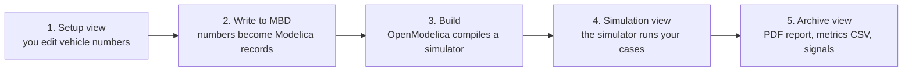

# BobDyn/BobSim Startup

By the end of this page you will have the BobSim app open, a vehicle saved,
that vehicle written into the Modelica stack, one simulation run, and a PDF
report to look at.

You need only Git, Make, and Docker. The app and every simulation run inside
the BobSim Docker image, which contains OpenModelica. You do not install
OpenModelica or Python.

## How BobSim Works

BobSim never simulates anything itself. It turns your vehicle numbers into
Modelica code, hands that to OpenModelica to compile, runs the compiled
program, and collects what comes back.



<details class="diagram-text">
<summary>Text version</summary>

1. Setup view: you edit vehicle numbers.
2. Write to MBD: the numbers become Modelica records.
3. Build: OpenModelica compiles a simulator.
4. Simulation view: the simulator runs your cases.
5. Archive view: PDF report, metrics CSV, signals.

</details>

That chain is why the app locks each step until the one before it is done. The
left rail has four views:

| View | What it is for |
| :-- | :-- |
| `Setup` | Define the vehicle: architecture, geometry, mass, suspension, tires, aero, powertrain |
| `Simulation` | Configure and launch a study against the current vehicle |
| `Replay` | Play back a captured run in 3D: suspension geometry, tire loads, and grip |
| `Archive` | Download reports, metrics, and signal data from finished runs |

`Replay` is not part of the chain. It draws scenes that you capture separately.
See [Replay A Captured Run](#replay-a-captured-run).

## Install What BobSim Needs

| Tool | Why |
| :-- | :-- |
| Git | Clone BobSim and its BobLib submodule |
| GNU Make | Every workflow is a `make` target |
| Docker with Docker Compose | The app and the `make` targets run inside the BobSim image |

The image is built from `openmodelica/openmodelica:v1.26.3-ompython`. It
installs the exact Modelica libraries BobLib needs (Modelica `4.1.0` and
VehicleInterfaces `2.0.2`) and the Python packages in `requirements.txt`. It
builds on x86_64 and on ARM64 hosts, including Apple Silicon.

## Step 1: Clone BobSim

Clone with submodules. BobSim vendors BobDyn/BobLib at
`_0_Utils/external/BobLib/`.

```bash
git clone --recurse-submodules https://github.com/BobDyn/BobSim.git
cd BobSim
make init
```

`make init` runs `git submodule update --init --recursive`. Do not skip it.
Without BobLib every Modelica build fails.

::: info Where commands run
Everything in this guide runs from the BobSim repository root, the directory
the clone step created.
:::

## Step 2: Build The Docker Image

```bash
make docker-build
```

This builds the `bobdyn/bobsim:latest` image. The first build downloads the
OpenModelica base image and can take some time. Later builds reuse it.

List every target with a description:

```bash
make help
```

## Step 3: Launch The App

```bash
make app
```

The terminal prints:

```text
BobSim app in Docker. Open http://127.0.0.1:8765
...
BobSim app running at http://0.0.0.0:8765
```

Open `http://127.0.0.1:8765`. The second line is the address inside the
container. Docker publishes it on `127.0.0.1` only, so the app is not visible
to other machines on your network.

Stop the app with `Ctrl+C` in the same terminal. That also removes the
container.

To use a different port:

```bash
make app APP_PORT=8766
```

The repository directory is mounted into the container. Everything the app
saves lands in your checkout, the same as for the `make` targets.

## Step 4: Confirm OpenModelica

Click `OpenModelica` in the top bar to open the `Toolchain` dialog. In Docker
it shows `omc` as `/usr/bin/omc` and `Libraries` as
`/root/.openmodelica/libraries`. The app finds both on its own. You do not
need to change or save anything.

## Step 5: Choose A Vehicle

The first screen is the vehicle dialog.


| Path | Use it when |
| :-- | :-- |
| `Load Vehicle` | You already saved a vehicle in this app |
| `Create Vehicle` | You want a fresh vehicle from a checked-in architecture template |
| `Import YAML` | You have a vehicle YAML file from somewhere else |
| `Continue Active File` | You want to keep working from the repo's active `vehicle.yml` |

For a first run, pick `Create Vehicle`: choose a template, type a name, and
click the button. Templates are named `<front>_<rear>` by suspension
architecture, for example `DWBC_DWBCRecord`.

## Step 6: Work Through Setup

Setup has eight steps. The tabs across the top are numbered, and `Next` and
`Previous` walk them in order:

1. Architecture
2. Geometry
3. Mass
4. Suspension
5. Compliances
6. Tires
7. Aero
8. Powertrain

The left pane is the editor, the right pane is a live preview of whatever the
current step affects. The `?` button beside the editor title opens the app's
own notes for that step: what it is for, what the preview shows, and what to
sanity-check before moving on.


The Tires step also takes `.tir` files and redraws its pure and combined slip
load maps from the active tire as you edit.


You do not have to finish all eight steps before simulating. A template is
already internally consistent, so you can run it as-is the first time.

## Step 7: Save And Write To MBD

Two buttons at the bottom of the left rail, in this order:

1. Click `Save Vehicle`.
2. Click `Write to MBD`.

`Write to MBD` writes the vehicle as Modelica records into the BobLib
submodule, under `BobLib/Records/VehicleDefn/`. The status strip in the top bar
tracks the chain from [How BobSim Works](#how-bobsim-works):

| Status | Meaning |
| :-- | :-- |
| `BobLib` | The BobLib submodule is present |
| `Vehicle Definition` | The saved vehicle has been written to the Modelica stack |
| `VehicleSim` | The RampSteer/SteadyState/Transient build is ready, missing, or stale |
| `FourPostSim` | The four-post build is ready, missing, or stale |

If `Write to MBD` is greyed out, hover it. The button states its own reason,
and the fix is usually one of:

- *Initialize the BobLib submodule first* — run `make init`
- *Save this vehicle config before writing to MBD* — click `Save Vehicle`
- *Vehicle definition is already current in MBD* — nothing to do, move on

## Step 8: Run Your First Simulation

Open `Simulation`.


| Card | Use it for |
| :-- | :-- |
| `Ramp Steer` | Open-loop steering ramp response |
| `Steady State` | Settled lateral-acceleration operating points |
| `Transient` | Step and sine steering response |
| `Four Post` | Heave, roll, and vertical-force suspension procedures |

Each card explains what the run does, which parameters matter, and what it
produces. For a first proof run, take `Ramp Steer`:

1. Click `Configure`.
2. Read the run fields. Change nothing yet.
3. Click `Build + Run RampSteerEval`.
4. Switch to the `Run Log` tab and watch.
5. Click `Review` when it finishes.

The first build is slow: OpenModelica is compiling the whole vehicle model.
Later runs reuse it unless the vehicle definition changed, which is what the
`VehicleSim` and `FourPostSim` status lights are telling you.

If you edit a config field, the run button becomes `Apply + Build + Run`.
Either click `Apply Edits` first, or let the run button apply them for you.


## Step 9: Review The Results

Open `Archive`, or click `Review` on the workflow card.


Every successful run becomes an archive package you can download:

- the generated PDF report, previewable in the browser
- the metrics CSV
- `signals.zip`, holding a `manifest.json` and one folder per run with
  `signals.csv`, `overrides.txt`, `run.log`, and `description.json`
- `run-description.json`, which describes the run
- `vehicle.yml` and `config.yml`, snapshots of the vehicle and study config
  that produced the run

FourPostEval leaves raw time-series appendix pages out of its PDF by default
(`raw_time_series_appendix: false`) so the K&C report stays readable.

`Delete` removes a package from both the global archive and the vehicle
workspace.

## Where BobSim Puts Your Files

| Path | Contents |
| :-- | :-- |
| `_3_StandardSim/generated_results/` | Reports and metric CSVs from the standard studies |
| `_3_StandardSim/BuildBobLib/VehicleSim/` | Compiled `VehicleSim` and its run directories |
| `_3_StandardSim/BuildBobLib/FourPostSim/` | Compiled `FourPostSim` and its run directories |
| `_5_App/user_data/config/vehicles/` | Saved vehicles, one YAML per vehicle |
| `_5_App/user_data/config/simulations/` | Saved simulation configs |
| `_5_App/user_data/config/active/` | The app's editable copies of the study configs |
| `_5_App/user_data/config/defaults/` | Original copies of the EnvelopeSim and OptSim configs |
| `_5_App/user_data/config/app/` | App settings. The app in Docker keeps its OpenModelica choice in `openmodelica.docker.json`, the app on the host in `openmodelica.json`. |
| `_5_App/user_data/results/saved/` | Archive packages |
| `_5_App/user_data/workspaces/vehicles/<vehicle>/` | Per-vehicle builds, results, and processing |
| `_5_App/user_data/cache/modelica/` | Modelica build cache |

On Linux, files written from the container belong to `root`. `make clean-owned`
deletes the generated results and app data through the container, so you do
not need `sudo`.

## The CLI Path

The `make` targets run the same studies without the app, for scripts and CI.
They also run inside Docker and share the builds in `_3_StandardSim/BuildBobLib/`
with the app.

```bash
make standard-eval-ramp-steer
make standard-eval-steady-state
make standard-eval-transient
make standard-eval-four-post
make standard-eval-all
```

Each target builds what it needs first (`make standard-build` or
`make standard-build-four-post`). The build targets depend on the records in
`BobLib/Records/VehicleDefn/`, so after `Write to MBD` changes them, `make`
rebuilds before it runs. Reports go to `_3_StandardSim/generated_results/`, for
example `ramp_steer_eval_report.pdf`.

::: warning The CLI reads the app's config copies
When you edit a study config in the app, BobSim writes the change to
`_5_App/user_data/config/active/`. After that, the `make standard-eval-*`
targets read that copy, not the checked-in file under `_3_StandardSim/`. Set
`BOBSIM_SEED_CONFIGS=1` to force the checked-in file.
:::

Envelope and sensitivity workflows:

```bash
make envelope-all
make opt-standard
make opt-envelope
make opt-refined
```

Check that the BobLib records match the active `vehicle.yml` without the app:

```bash
make sync-vehicle
make sync-vehicle-write
```

`make sync-vehicle` reports stale records and exits with an error if it finds
any. `make sync-vehicle-write` regenerates them.

Open a shell inside the container with `make shell`. Run lint, typecheck, and
tests with `make ci`.

## Replay A Captured Run

The `Replay` view plays back a run in 3D. A normal simulation run does not feed
it, because a normal run keeps only the signals its metrics need. Until you
capture a scene, `Replay` shows "No captured runs yet".

To see `Replay` work, write the synthetic demo scene. It needs no simulation.
Then start the app and open `Replay`:

```bash
make visual-demo
make app
```

To capture a real run, BobSim runs one study again in Docker and records the
suspension geometry:

```bash
make visual-rig
make visual-maneuver VISUAL_MANEUVER=transient
```

`visual-rig` captures the four-post rig. `visual-maneuver` takes `transient`,
`ramp_steer`, or `steady_state`. Scenes are written to `_1_VisualSim/results/`.
In the view, `Controls` shows the camera keys and `Export video` saves a
recording.

::: info These targets need Python on your machine
The simulation step of `visual-rig` and `visual-maneuver` runs in Docker. The
scene generation and conversion steps, and all of `visual-demo`, run on your
machine. They need Python 3.11 with `requirements.txt` installed, as in
[Run The App Without Docker](#run-the-app-without-docker).
:::

## Run The App Without Docker

`RUN=` empties the Docker prefix, so a target runs directly on your machine:

```bash
make app RUN=
```

On the host, the app needs a Python 3.11 environment with the BobSim
dependencies:

```bash
python -m venv .venv
source .venv/bin/activate
python -m pip install --upgrade pip
python -m pip install -r requirements.txt
```

On Windows PowerShell, activate with `.venv\Scripts\Activate.ps1` instead.

To simulate from the app on the host, you also need a local OpenModelica with
the exact library versions:

```text
installPackage(Modelica, "4.1.0", exactMatch=true);
installPackage(VehicleInterfaces, "2.0.2", exactMatch=true);
```

Without it, the `Simulation` view stays locked, and everything else in the app
works.

The app looks for OpenModelica on its own every time it checks status. It
searches the usual install locations and these environment variables:

| Variable | Sets |
| :-- | :-- |
| `BOBSIM_OMC`, or `OMC` | The `omc` executable |
| `BOBSIM_OPENMODELICA_HOME`, or `OPENMODELICAHOME` | The OpenModelica install directory |
| `BOBSIM_OPENMODELICA_LIBRARY` | The library directory |

If detection finds nothing, set the two fields in the `Toolchain` dialog by
hand. The dialog lists the candidate paths it found:

- **omc executable**: `omc.exe` on Windows, `omc` elsewhere
- **Library directory**: where `installPackage` put Modelica and
  VehicleInterfaces

| Platform | Typical library directory |
| :-- | :-- |
| Windows | `%APPDATA%\.openmodelica\libraries` |
| macOS | `~/.openmodelica/libraries` |
| Linux | `~/.openmodelica/libraries` |

Click `Save`. BobSim checks that the executable runs and that both required
libraries are present, and names the missing one if not. `Auto` clears your
manual paths and goes back to automatic detection.

The toolchain check only looks for the library folders. It does not compare
versions, so a wrong version passes the check and then fails at build time.

`RUN=` works the same way for the simulation targets, for example
`make standard-eval-all RUN=`. They then need a local `omc` with the exact
library versions. GitHub Actions uses `RUN=` for its fast gate
(`make lint RUN=`, `make typecheck RUN=`, `make test RUN=`).

## The Released Desktop App

The [GitHub Release](https://github.com/BobDyn/BobSim/releases/latest) has a
desktop build of the app. It bundles its own Python, but it does not use
Docker. To simulate, it needs a local OpenModelica, set up as in
[Run The App Without Docker](#run-the-app-without-docker).

Download the asset for your operating system, extract it, and run
`BobSim.exe` on Windows, `BobSim.app` on macOS, or `BobSim` on Linux. Assets
are named `BobSim-<version>-<os>-<arch>`, for example
`BobSim-<version>-windows-x86_64.zip`. They ship as `.zip` on Windows and
macOS and as `.tar.gz` on Linux. Each asset has a `.sha256` checksum file next
to it. The macOS asset is built for Apple Silicon (`arm64`).

The desktop app starts the same local server as `make app`, picks a free port,
and opens it in an embedded window. If that window is unavailable it falls
back to your default browser. On Linux the embedded window needs GTK (`gi`) or
PyQt6-WebEngine.

It keeps its files in a per-user runtime root instead of the repository:

| Platform | Runtime root |
| :-- | :-- |
| Windows | `%LOCALAPPDATA%\BobDyn\BobSim` |
| macOS | `~/Library/Application Support/BobDyn/BobSim` |
| Linux | `${XDG_DATA_HOME:-~/.local/share}/BobDyn/BobSim` |

Set `BOBSIM_HOME` to put it somewhere else.

## Common Problems

### BobLib submodule missing

```bash
make init
```

### make app or another target fails with a Docker error

Check that Docker is running and that `docker compose version` works. Then
build the image again:

```bash
make docker-build
```

### The app page does not load

Open `http://127.0.0.1:8765`, not the `0.0.0.0` address the container prints.
If another program already uses port 8765, start the app with
`make app APP_PORT=8766` and open that port.

### Simulation is locked

Hover the locked control. It names the reason. In order, the app wants the
vehicle saved, then written to MBD, then a verified OpenModelica toolchain. In
Docker the toolchain is always present. On the host, see
[Run The App Without Docker](#run-the-app-without-docker).

### No module named yaml

You are running the app or a `visual-*` target on the host without the
dependencies. Install them into the same interpreter:

```bash
python -m pip install -r requirements.txt
```

### Toolchain saved but a library is reported missing

This happens on the host only. The library directory does not contain that
library at all. Check that `Library directory` points at the folder
`installPackage` wrote to, and install the exact versions.

### A run failed and you want the raw directory

It is already there. All four shipped configs set `execution.cleanup: false`,
so run directories are kept under the build directory:

```text
_3_StandardSim/BuildBobLib/VehicleSim/results/run_<id>/
_3_StandardSim/BuildBobLib/FourPostSim/results/run_<id>/
```

If `results/` is not writable, BobSim writes to `runs/` in the same build
directory instead.

Each holds `run.log`, `overrides.txt`, the raw result CSV, and a manifest. If
the directory is gone, something set `execution.cleanup: true`. Check the app's
copy in `_5_App/user_data/config/active/` first, then the checked-in config.
Set it back to `false` and rerun.

### You want to start the app from a clean state

This deletes saved vehicles, configs, toolchain settings, workspaces, the
build cache, and archive packages in `_5_App/user_data/`:

```bash
make clean-app
```

## Next Pages

- [BobSim App](/bobsim/app) for a full tour of the app views
- [BobSim Use Guide](/use-guide/bobsim) for the normal workflow after setup
- [BobDyn/BobSim overview](/bobsim/) for the repo map and CLI target language
- [StandardSim](/bobsim/standard-sim) for the high-fidelity evaluation details
- [Configuration](/bobsim/configuration) for YAML and build details
